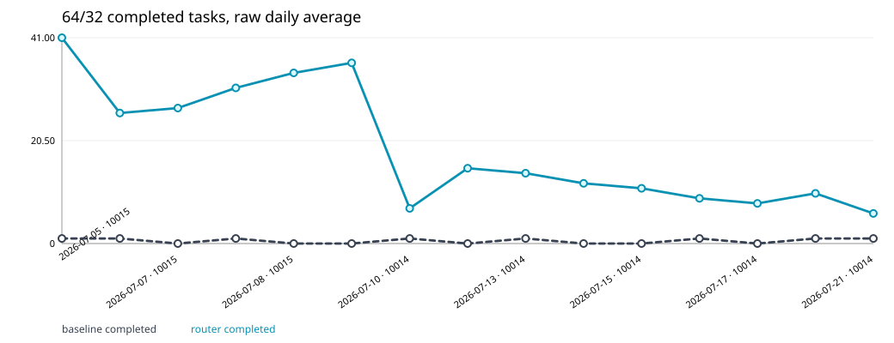
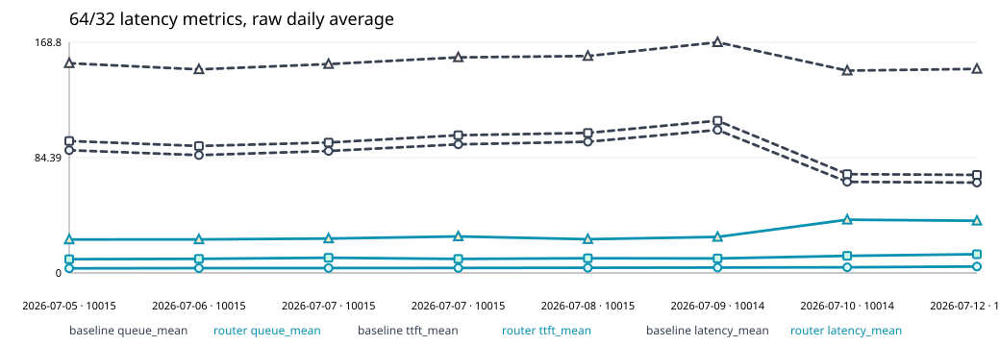
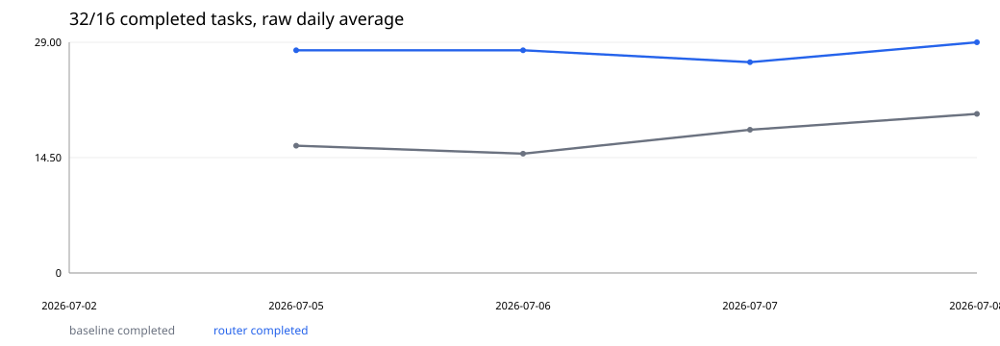
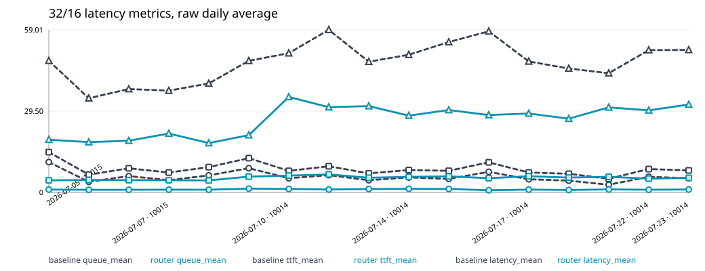
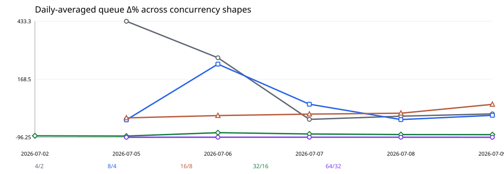
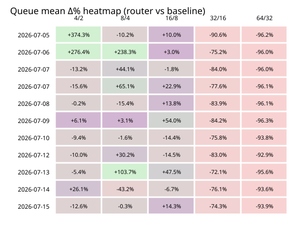

# AgentCache Benchmark Dashboard

Generated from compact `dashboard-summary.json` artifacts. Daily trends contain one logical run per experiment ID.

Run groups indexed: **16** · Source runs: **23**

## Qualification and coverage

| experiment | kind | coverage | trend eligible | qualification |
| --- | --- | --- | --- | --- |
| legacy-daily-10014-2026-07-09-daily-09 | daily | complete: 16/8, 32/16, 4/2, 64/32, 8/4 (expected 4/2, 8/4, 16/8, 32/16, 64/32) | true | none |
| daily-2026-07-10-10014 | daily | complete: 16/8, 32/16, 4/2, 64/32, 8/4 (expected 4/2, 8/4, 16/8, 32/16, 64/32) | true | Known regression/anomaly; see source report. |
| scheduler-ab-2026-07-10-12 | scheduler_ab | focused: 32/16 (expected 32/16, 64/32) | false | One sample per scheduler/shape cell; no statistical confidence. |
| scheduler-ab-2026-07-10-12 | scheduler_ab | focused: 32/16 (expected 32/16, 64/32) | false | One sample per scheduler/shape cell; no statistical confidence. |
| scheduler-ab-2026-07-10-12 | scheduler_ab | focused: 64/32 (expected 32/16, 64/32) | false | One sample per scheduler/shape cell; no statistical confidence. |
| daily-2026-07-12-10014 | daily | complete: 16/8, 32/16, 4/2, 64/32, 8/4 (expected 4/2, 8/4, 16/8, 32/16, 64/32) | true | High variance at 64/32; interpret the single daily sample with caution. |
| scheduler-ab-2026-07-10-12 | scheduler_ab | focused: 64/32 (expected 32/16, 64/32) | false | One sample per scheduler/shape cell; no statistical confidence. |
| daily-2026-07-13-10014 | daily | complete: 16/8, 32/16, 4/2, 64/32, 8/4 (expected 4/2, 8/4, 16/8, 32/16, 64/32) | true | Task counts are runtime completion, not SWE-bench correctness; the experiment crossed midnight and completed on 2026-07-14; 8/4 router had one validation-loop failure; 64/32 is high variance despite service-level gains, with 50 router task timeouts and 11 topology-fetch failures. |
| daily-2026-07-14-10014 | daily | complete: 16/8, 32/16, 4/2, 64/32, 8/4 (expected 4/2, 8/4, 16/8, 32/16, 64/32) | true | Task counts are runtime completion, not SWE-bench correctness; 16/8 router completed two fewer tasks than baseline; 64/32 is high variance despite service-level gains, with 52 router task timeouts and 22 topology-fetch failures. |
| daily-2026-07-15-10014 | daily | complete: 16/8, 32/16, 4/2, 64/32, 8/4 (expected 4/2, 8/4, 16/8, 32/16, 64/32) | true | Task counts are runtime completion, not SWE-bench correctness; the experiment crossed midnight and completed on 2026-07-16; 4/2 router had one validation-loop failure; 64/32 is high variance despite service-level gains, with 53 router task timeouts and 16 topology-fetch failures. |
| daily-2026-07-16-10014 | daily | complete: 16/8, 32/16, 4/2, 64/32, 8/4 (expected 4/2, 8/4, 16/8, 32/16, 64/32) | true | Task counts are runtime completion, not SWE-bench correctness; 4/2 router had one validation-loop failure; 8/4 and 16/8 were mixed; router completion changed from 14 to 17 at 32/16 and from 1 to 9 at 64/32; 64/32 remained high variance with 54 router task timeouts, one validation-loop failure, 48 traceback tokens, and 24 topology-fetch failures. |
| daily-2026-07-17-10014 | daily | complete: 16/8, 32/16, 4/2, 64/32, 8/4 (expected 4/2, 8/4, 16/8, 32/16, 64/32) | true | Task counts are runtime completion, not SWE-bench correctness; the experiment crossed midnight and completed on 2026-07-18; router completion changed from 3 to 4 at 4/2, from 14 to 16 at 16/8, from 19 to 22 at 32/16, and from 0 to 8 at 64/32; 64/32 remained high variance with 56 router task timeouts, 18 traceback tokens, and 9 topology-fetch failures. |
| daily-2026-07-20-10014 | daily | complete: 16/8, 32/16, 4/2, 64/32, 8/4 (expected 4/2, 8/4, 16/8, 32/16, 64/32) | true | Task counts are runtime completion, not SWE-bench correctness; the experiment crossed midnight and completed on 2026-07-21; router completion fell from 8 to 6 at 8/4, rose from 18 to 21 at 32/16, and rose from 1 to 10 at 64/32; 64/32 remained high variance with 53 router task timeouts, one confirmation hang, 50 traceback tokens, and 25 topology-fetch failures. |
| daily-2026-07-21-10014 | daily | complete: 16/8, 32/16, 4/2, 64/32, 8/4 (expected 4/2, 8/4, 16/8, 32/16, 64/32) | true | Task counts are runtime completion, not SWE-bench correctness; the experiment crossed midnight and completed on 2026-07-22; router completion rose from 14 to 16 at 16/8, from 18 to 25 at 32/16, and from 1 to 6 at 64/32; 64/32 remained high variance with 58 router task timeouts, 52 traceback tokens, 19 connect timeouts, 7 read timeouts, and 26 topology-fetch failures. |
| daily-2026-07-22-10014 | daily | complete: 16/8, 32/16, 4/2, 64/32, 8/4 (expected 4/2, 8/4, 16/8, 32/16, 64/32) | true | Task counts are runtime completion, not SWE-bench correctness; router completion fell from 4 to 3 at 4/2 and from 8 to 7 at 8/4, tied at 15 at 16/8, rose from 13 to 24 at 32/16, and rose from 2 to 10 at 64/32; 64/32 remained high variance with 54 router task timeouts, 24 traceback tokens, 12 read timeouts, and 12 topology-fetch failures. |
| legacy-daily-10015-2026-07-02-daily-02-32_16 | daily | partial: 32/16 (expected 4/2, 8/4, 16/8, 32/16, 64/32) | false | none |
| legacy-daily-10015-2026-07-02-daily-02-smoke-1_1 | daily | partial: 1/1 (expected 4/2, 8/4, 16/8, 32/16, 64/32) | false | none |
| legacy-daily-10015-2026-07-05-daily-05-table1 | daily | complete: 16/8, 32/16, 4/2, 64/32, 8/4 (expected 4/2, 8/4, 16/8, 32/16, 64/32) | true | none |
| legacy-daily-10015-2026-07-05-daily-05-table2 | daily | partial: 16/8, 4/2, 8/4 (expected 4/2, 8/4, 16/8, 32/16, 64/32) | false | none |
| legacy-daily-10015-2026-07-06-daily-06 | daily | complete: 16/8, 32/16, 4/2, 64/32, 8/4 (expected 4/2, 8/4, 16/8, 32/16, 64/32) | true | none |
| legacy-daily-10015-2026-07-07-daily-07 | daily | complete: 16/8, 32/16, 4/2, 64/32, 8/4 (expected 4/2, 8/4, 16/8, 32/16, 64/32) | true | none |
| legacy-daily-10015-2026-07-07-daily-07-phase6 | daily | complete: 16/8, 32/16, 4/2, 64/32, 8/4 (expected 4/2, 8/4, 16/8, 32/16, 64/32) | true | none |
| legacy-daily-10015-2026-07-08-daily-08 | daily | complete: 16/8, 32/16, 4/2, 64/32, 8/4 (expected 4/2, 8/4, 16/8, 32/16, 64/32) | true | none |

## Experiment provenance

| day | host | profile | hardware / GPU | driver | CUDA | vLLM version / commit | AgentCache branch | AgentCache commit |
| --- | --- | --- | --- | --- | --- | --- | --- | --- |
| 2026-07-22 | 10014 | historical-full | 2 x NVIDIA L20, 46068 MiB each (documented-shared-testbed) | N/A (unavailable) | N/A (unavailable) | /home/zhike/dxw/vllm-0.22.1 at 0decac0d96c42b49572498019f0a0e3600f50398 (historical-report) | N/A (unavailable) | 075f444a64dc367f91ecee5b124bb22405e6fd4b (historical-report) |
| 2026-07-21 | 10014 | historical-full | 2 x NVIDIA L20, 46068 MiB each (documented-shared-testbed) | N/A (unavailable) | N/A (unavailable) | /home/zhike/dxw/vllm-0.22.1 at 0decac0d96c42b49572498019f0a0e3600f50398 (historical-report) | N/A (unavailable) | 075f444a64dc367f91ecee5b124bb22405e6fd4b (historical-report) |
| 2026-07-20 | 10014 | historical-full | 2 x NVIDIA L20, 46068 MiB each (documented-shared-testbed) | N/A (unavailable) | N/A (unavailable) | /home/zhike/dxw/vllm-0.22.1 at 0decac0d96c42b49572498019f0a0e3600f50398 (historical-report) | N/A (unavailable) | 075f444a64dc367f91ecee5b124bb22405e6fd4b (historical-report) |
| 2026-07-17 | 10014 | historical-full | 2 x NVIDIA L20, 46068 MiB each (documented-shared-testbed) | N/A (unavailable) | N/A (unavailable) | /home/zhike/dxw/vllm-0.22.1 at 0decac0d96c42b49572498019f0a0e3600f50398 (historical-report) | N/A (unavailable) | 075f444a64dc367f91ecee5b124bb22405e6fd4b (historical-report) |
| 2026-07-16 | 10014 | historical-full | 2 x NVIDIA L20, 46068 MiB each (documented-shared-testbed) | N/A (unavailable) | N/A (unavailable) | /home/zhike/dxw/vllm-0.22.1 at 0decac0d96c42b49572498019f0a0e3600f50398 (historical-report) | N/A (unavailable) | 075f444a64dc367f91ecee5b124bb22405e6fd4b (historical-report) |
| 2026-07-15 | 10014 | historical-full | 2 x NVIDIA L20, 46068 MiB each (documented-shared-testbed) | N/A (unavailable) | N/A (unavailable) | /home/zhike/dxw/vllm-0.22.1 at 0decac0d96c42b49572498019f0a0e3600f50398 (historical-report) | N/A (unavailable) | 075f444a64dc367f91ecee5b124bb22405e6fd4b (historical-report) |
| 2026-07-14 | 10014 | historical-full | 2 x NVIDIA L20, 46068 MiB each (documented-shared-testbed) | N/A (unavailable) | N/A (unavailable) | /home/zhike/dxw/vllm-0.22.1 at 0decac0d96c42b49572498019f0a0e3600f50398 (historical-report) | N/A (unavailable) | 075f444a64dc367f91ecee5b124bb22405e6fd4b (historical-report) |
| 2026-07-13 | 10014 | historical-full | 2 x NVIDIA L20, 46068 MiB each (documented-shared-testbed) | N/A (unavailable) | N/A (unavailable) | /home/zhike/dxw/vllm-0.22.1 at 0decac0d96c42b49572498019f0a0e3600f50398 (historical-report) | N/A (unavailable) | 9c05e0a3cd245d4d3cda3bde2bfeb8819b33e388 (historical-report) |
| 2026-07-12 | 10014 | scheduler-ab | N/A (unavailable) | N/A (unavailable) | N/A (unavailable) | N/A (unavailable) | release (unavailable) | 9c05e0a3cd245d4d3cda3bde2bfeb8819b33e388 (unavailable) |
| 2026-07-12 | 10014 | historical-full | 2 x NVIDIA L20, 46068 MiB each (documented-shared-testbed) | N/A (unavailable) | N/A (unavailable) | 0.22.2.dev0+g0decac0d9.d20260629 from commit 0decac0d9 (historical-report) | N/A (unavailable) | 9c05e0a3cd245d4d3cda3bde2bfeb8819b33e388 (historical-report) |
| 2026-07-11 | 10014 | scheduler-ab | N/A (unavailable) | N/A (unavailable) | N/A (unavailable) | N/A (unavailable) | release (unavailable) | 9c05e0a3cd245d4d3cda3bde2bfeb8819b33e388 (unavailable) |
| 2026-07-11 | 10014 | scheduler-ab | N/A (unavailable) | N/A (unavailable) | N/A (unavailable) | N/A (unavailable) | release (unavailable) | 9c05e0a3cd245d4d3cda3bde2bfeb8819b33e388 (unavailable) |
| 2026-07-10 | 10014 | scheduler-ab | N/A (unavailable) | N/A (unavailable) | N/A (unavailable) | N/A (unavailable) | release (unavailable) | 9c05e0a3cd245d4d3cda3bde2bfeb8819b33e388 (unavailable) |
| 2026-07-10 | 10014 | historical-full | 2 x NVIDIA L20, 46068 MiB each (documented-shared-testbed) | N/A (unavailable) | N/A (unavailable) | N/A (unavailable) | release-v0.2 (historical-report) | 027d360 (historical-report) |
| 2026-07-09 | 10014 | historical-full | 2 x NVIDIA L20, 46068 MiB each (current-machine-verification, verified 2026-07-10) | 580.159.03 (current-machine-verification, verified 2026-07-10) | 13.0 (current-machine-verification, verified 2026-07-10) | 0.22.2.dev0+g0decac0d9.d20260629 / 0decac0d96c42b49572498019f0a0e3600f50398 (current-machine-verification, verified 2026-07-10) | release-v0.2 (historical-report) | da3b89a (historical-report) |
| 2026-07-08 | 10015 | historical-full | 2 x NVIDIA L20, 46068 MiB each (documented-shared-testbed) | N/A (unavailable) | N/A (unavailable) | N/A (unavailable) | N/A (unavailable) | f4b5d7a (historical-report) |
| 2026-07-07 | 10015 | historical-full | 2 x NVIDIA L20, 46068 MiB each (documented-shared-testbed) | N/A (unavailable) | N/A (unavailable) | N/A (unavailable) | N/A (unavailable) | 50f5a13 (historical-report) |
| 2026-07-07 | 10015 | historical-full | 2 x NVIDIA L20, 46068 MiB each (documented-shared-testbed) | N/A (unavailable) | N/A (unavailable) | N/A (unavailable) | N/A (unavailable) | 61aa36e (historical-report) |
| 2026-07-06 | 10015 | historical-full | 2 x NVIDIA L20, 46068 MiB each (documented-shared-testbed) | N/A (unavailable) | N/A (unavailable) | N/A (unavailable) | N/A (unavailable) | 2d75887 (historical-report) |
| 2026-07-05 | 10015 | historical-partial | 2 x NVIDIA L20, 46068 MiB each (documented-shared-testbed) | N/A (unavailable) | N/A (unavailable) | N/A (unavailable) | N/A (unavailable) | 5fff3ec (historical-report) |
| 2026-07-05 | 10015 | historical-full | 2 x NVIDIA L20, 46068 MiB each (documented-shared-testbed) | N/A (unavailable) | N/A (unavailable) | N/A (unavailable) | N/A (unavailable) | 5fff3ec (historical-report) |
| 2026-07-02 | 10015 | historical-partial | 2 x NVIDIA L20, 46068 MiB each (documented-shared-testbed) | N/A (unavailable) | N/A (unavailable) | N/A (unavailable) | N/A (unavailable) | N/A (unavailable) |
| 2026-07-02 | 10015 | historical-partial | 2 x NVIDIA L20, 46068 MiB each (documented-shared-testbed) | N/A (unavailable) | N/A (unavailable) | N/A (unavailable) | N/A (unavailable) | N/A (unavailable) |

> Provenance labels: `run-recorded` was captured with the run; `historical-report` was recovered
> from its dated report; `documented-shared-testbed` comes from the documented shared 10014/10015
> hardware; `current-machine-verification` was checked later and is not asserted as run-time state;
> `unavailable` means no defensible value was recorded.

## Figures

### figures/shape-64_32-completed-tasks.svg

### figures/shape-64_32-latency-metrics.svg

### figures/shape-32_16-completed-tasks.svg

### figures/shape-32_16-latency-metrics.svg

### figures/daily-average-deltas-by-concurrency.svg

### figures/queue-delta-heatmap.svg

## Baseline by concurrency: completed

| day | host | 4/2 | 8/4 | 16/8 | 32/16 | 64/32 | avg |
| --- | --- | --- | --- | --- | --- | --- | --- |
| 2026-07-05 | 10015 | 4.000 | 7.000 | 14.00 | 16.00 | 1.000 | 8.400 |
| 2026-07-06 | 10015 | 4.000 | 6.000 | 14.00 | 15.00 | 1.000 | 8.000 |
| 2026-07-07 | 10015 | 4.000 | 7.000 | 14.00 | 15.00 | 0.000 | 8.000 |
| 2026-07-07 | 10015 | 3.000 | 8.000 | 14.00 | 21.00 | 1.000 | 9.400 |
| 2026-07-08 | 10015 | 3.000 | 6.000 | 14.00 | 20.00 | 0.000 | 8.600 |
| 2026-07-09 | 10014 | 2.000 | 8.000 | 14.00 | 18.00 | 0.000 | 8.400 |
| 2026-07-10 | 10014 | 2.000 | 8.000 | 16.00 | 21.00 | 1.000 | 9.600 |
| 2026-07-12 | 10014 | 3.000 | 8.000 | 15.00 | 11.00 | 0.000 | 7.400 |
| 2026-07-13 | 10014 | 4.000 | 8.000 | 16.00 | 21.00 | 1.000 | 10.00 |
| 2026-07-14 | 10014 | 4.000 | 8.000 | 14.00 | 16.00 | 0.000 | 8.400 |
| 2026-07-15 | 10014 | 4.000 | 7.000 | 14.00 | 14.00 | 0.000 | 7.800 |
| 2026-07-16 | 10014 | 4.000 | 7.000 | 15.00 | 14.00 | 1.000 | 8.200 |
| 2026-07-17 | 10014 | 3.000 | 7.000 | 14.00 | 19.00 | 0.000 | 8.600 |
| 2026-07-20 | 10014 | 4.000 | 8.000 | 15.00 | 18.00 | 1.000 | 9.200 |
| 2026-07-21 | 10014 | 4.000 | 7.000 | 14.00 | 18.00 | 1.000 | 8.800 |
| 2026-07-22 | 10014 | 4.000 | 8.000 | 15.00 | 13.00 | 2.000 | 8.400 |

## Router by concurrency: completed

| day | host | 4/2 | 8/4 | 16/8 | 32/16 | 64/32 | avg |
| --- | --- | --- | --- | --- | --- | --- | --- |
| 2026-07-05 | 10015 | 4.000 | 8.000 | 15.00 | 28.00 | 41.00 | 19.20 |
| 2026-07-06 | 10015 | 4.000 | 7.000 | 14.00 | 28.00 | 26.00 | 15.80 |
| 2026-07-07 | 10015 | 3.000 | 8.000 | 14.00 | 26.00 | 27.00 | 15.60 |
| 2026-07-07 | 10015 | 4.000 | 7.000 | 14.00 | 27.00 | 31.00 | 16.60 |
| 2026-07-08 | 10015 | 4.000 | 8.000 | 16.00 | 29.00 | 34.00 | 18.20 |
| 2026-07-09 | 10014 | 4.000 | 8.000 | 13.00 | 27.00 | 36.00 | 17.60 |
| 2026-07-10 | 10014 | 3.000 | 8.000 | 14.00 | 14.00 | 7.000 | 9.200 |
| 2026-07-12 | 10014 | 3.000 | 8.000 | 14.00 | 22.00 | 15.00 | 12.40 |
| 2026-07-13 | 10014 | 4.000 | 7.000 | 16.00 | 22.00 | 14.00 | 12.60 |
| 2026-07-14 | 10014 | 4.000 | 7.000 | 12.00 | 22.00 | 12.00 | 11.40 |
| 2026-07-15 | 10014 | 3.000 | 7.000 | 15.00 | 22.00 | 11.00 | 11.60 |
| 2026-07-16 | 10014 | 3.000 | 7.000 | 14.00 | 17.00 | 9.000 | 10.00 |
| 2026-07-17 | 10014 | 4.000 | 7.000 | 16.00 | 22.00 | 8.000 | 11.40 |
| 2026-07-20 | 10014 | 4.000 | 6.000 | 16.00 | 21.00 | 10.00 | 11.40 |
| 2026-07-21 | 10014 | 4.000 | 7.000 | 16.00 | 25.00 | 6.000 | 11.60 |
| 2026-07-22 | 10014 | 3.000 | 7.000 | 15.00 | 24.00 | 10.00 | 11.80 |

## Baseline by concurrency: failed

| day | host | 4/2 | 8/4 | 16/8 | 32/16 | 64/32 | avg |
| --- | --- | --- | --- | --- | --- | --- | --- |
| 2026-07-05 | 10015 | 0.000 | 1.000 | 2.000 | 16.00 | 63.00 | 16.40 |
| 2026-07-06 | 10015 | 0.000 | 2.000 | 2.000 | 17.00 | 63.00 | 16.80 |
| 2026-07-07 | 10015 | 0.000 | 1.000 | 2.000 | 17.00 | 64.00 | 16.80 |
| 2026-07-07 | 10015 | 1.000 | 0.000 | 2.000 | 11.00 | 63.00 | 15.40 |
| 2026-07-08 | 10015 | 1.000 | 2.000 | 2.000 | 12.00 | 64.00 | 16.20 |
| 2026-07-09 | 10014 | 2.000 | 0.000 | 2.000 | 14.00 | 64.00 | 16.40 |
| 2026-07-10 | 10014 | 2.000 | 0.000 | 0.000 | 11.00 | 63.00 | 15.20 |
| 2026-07-12 | 10014 | 1.000 | 0.000 | 1.000 | 21.00 | 64.00 | 17.40 |
| 2026-07-13 | 10014 | 0.000 | 0.000 | 0.000 | 11.00 | 63.00 | 14.80 |
| 2026-07-14 | 10014 | 0.000 | 0.000 | 2.000 | 16.00 | 64.00 | 16.40 |
| 2026-07-15 | 10014 | 0.000 | 1.000 | 2.000 | 18.00 | 64.00 | 17.00 |
| 2026-07-16 | 10014 | 0.000 | 1.000 | 1.000 | 18.00 | 63.00 | 16.60 |
| 2026-07-17 | 10014 | 1.000 | 1.000 | 2.000 | 13.00 | 64.00 | 16.20 |
| 2026-07-20 | 10014 | 0.000 | 0.000 | 1.000 | 14.00 | 63.00 | 15.60 |
| 2026-07-21 | 10014 | 0.000 | 1.000 | 2.000 | 14.00 | 63.00 | 16.00 |
| 2026-07-22 | 10014 | 0.000 | 0.000 | 1.000 | 19.00 | 62.00 | 16.40 |

## Router by concurrency: failed

| day | host | 4/2 | 8/4 | 16/8 | 32/16 | 64/32 | avg |
| --- | --- | --- | --- | --- | --- | --- | --- |
| 2026-07-05 | 10015 | 0.000 | 0.000 | 1.000 | 4.000 | 23.00 | 5.600 |
| 2026-07-06 | 10015 | 0.000 | 1.000 | 2.000 | 4.000 | 38.00 | 9.000 |
| 2026-07-07 | 10015 | 1.000 | 0.000 | 2.000 | 6.000 | 37.00 | 9.200 |
| 2026-07-07 | 10015 | 0.000 | 1.000 | 2.000 | 5.000 | 33.00 | 8.200 |
| 2026-07-08 | 10015 | 0.000 | 0.000 | 0.000 | 3.000 | 30.00 | 6.600 |
| 2026-07-09 | 10014 | 0.000 | 0.000 | 3.000 | 5.000 | 28.00 | 7.200 |
| 2026-07-10 | 10014 | 1.000 | 0.000 | 2.000 | 18.00 | 57.00 | 15.60 |
| 2026-07-12 | 10014 | 1.000 | 0.000 | 2.000 | 10.00 | 49.00 | 12.40 |
| 2026-07-13 | 10014 | 0.000 | 1.000 | 0.000 | 10.00 | 50.00 | 12.20 |
| 2026-07-14 | 10014 | 0.000 | 1.000 | 4.000 | 10.00 | 52.00 | 13.40 |
| 2026-07-15 | 10014 | 1.000 | 1.000 | 1.000 | 10.00 | 53.00 | 13.20 |
| 2026-07-16 | 10014 | 1.000 | 1.000 | 2.000 | 15.00 | 55.00 | 14.80 |
| 2026-07-17 | 10014 | 0.000 | 1.000 | 0.000 | 10.00 | 56.00 | 13.40 |
| 2026-07-20 | 10014 | 0.000 | 2.000 | 0.000 | 11.00 | 54.00 | 13.40 |
| 2026-07-21 | 10014 | 0.000 | 1.000 | 0.000 | 7.000 | 58.00 | 13.20 |
| 2026-07-22 | 10014 | 1.000 | 1.000 | 1.000 | 8.000 | 54.00 | 13.00 |

## Baseline by concurrency: patches

| day | host | 4/2 | 8/4 | 16/8 | 32/16 | 64/32 | avg |
| --- | --- | --- | --- | --- | --- | --- | --- |
| 2026-07-05 | 10015 | 4.000 | 7.000 | 13.00 | 15.00 | 1.000 | 8.000 |
| 2026-07-06 | 10015 | 4.000 | 6.000 | 14.00 | 14.00 | 0.000 | 7.600 |
| 2026-07-07 | 10015 | 4.000 | 6.000 | 14.00 | 13.00 | 0.000 | 7.400 |
| 2026-07-07 | 10015 | 3.000 | 8.000 | 13.00 | 16.00 | 0.000 | 8.000 |
| 2026-07-08 | 10015 | 3.000 | 6.000 | 13.00 | 14.00 | 0.000 | 7.200 |
| 2026-07-09 | 10014 | 2.000 | 7.000 | 14.00 | 13.00 | 0.000 | 7.200 |
| 2026-07-10 | 10014 | 2.000 | 8.000 | 14.00 | 16.00 | 1.000 | 8.200 |
| 2026-07-12 | 10014 | 3.000 | 7.000 | 15.00 | 10.00 | 0.000 | 7.000 |
| 2026-07-13 | 10014 | 4.000 | 8.000 | 14.00 | 16.00 | 0.000 | 8.400 |
| 2026-07-14 | 10014 | 4.000 | 8.000 | 13.00 | 12.00 | 0.000 | 7.400 |
| 2026-07-15 | 10014 | 4.000 | 7.000 | 14.00 | 13.00 | 0.000 | 7.600 |
| 2026-07-16 | 10014 | 4.000 | 7.000 | 15.00 | 8.000 | 0.000 | 6.800 |
| 2026-07-17 | 10014 | 2.000 | 6.000 | 13.00 | 14.00 | 0.000 | 7.000 |
| 2026-07-20 | 10014 | 4.000 | 8.000 | 13.00 | 14.00 | 0.000 | 7.800 |
| 2026-07-21 | 10014 | 4.000 | 6.000 | 13.00 | 15.00 | 0.000 | 7.600 |
| 2026-07-22 | 10014 | 4.000 | 8.000 | 13.00 | 11.00 | 0.000 | 7.200 |

## Router by concurrency: patches

| day | host | 4/2 | 8/4 | 16/8 | 32/16 | 64/32 | avg |
| --- | --- | --- | --- | --- | --- | --- | --- |
| 2026-07-05 | 10015 | 4.000 | 8.000 | 14.00 | 27.00 | 40.00 | 18.60 |
| 2026-07-06 | 10015 | 4.000 | 7.000 | 13.00 | 27.00 | 24.00 | 15.00 |
| 2026-07-07 | 10015 | 3.000 | 7.000 | 12.00 | 26.00 | 26.00 | 14.80 |
| 2026-07-07 | 10015 | 3.000 | 7.000 | 13.00 | 27.00 | 31.00 | 16.20 |
| 2026-07-08 | 10015 | 4.000 | 8.000 | 15.00 | 29.00 | 32.00 | 17.60 |
| 2026-07-09 | 10014 | 4.000 | 7.000 | 11.00 | 27.00 | 30.00 | 15.80 |
| 2026-07-10 | 10014 | 2.000 | 7.000 | 13.00 | 14.00 | 6.000 | 8.400 |
| 2026-07-12 | 10014 | 3.000 | 8.000 | 12.00 | 22.00 | 15.00 | 12.00 |
| 2026-07-13 | 10014 | 4.000 | 4.000 | 14.00 | 22.00 | 14.00 | 11.60 |
| 2026-07-14 | 10014 | 3.000 | 7.000 | 10.00 | 21.00 | 11.00 | 10.40 |
| 2026-07-15 | 10014 | 3.000 | 6.000 | 14.00 | 22.00 | 9.000 | 10.80 |
| 2026-07-16 | 10014 | 3.000 | 7.000 | 13.00 | 17.00 | 9.000 | 9.800 |
| 2026-07-17 | 10014 | 4.000 | 7.000 | 15.00 | 21.00 | 8.000 | 11.00 |
| 2026-07-20 | 10014 | 4.000 | 6.000 | 15.00 | 20.00 | 8.000 | 10.60 |
| 2026-07-21 | 10014 | 4.000 | 7.000 | 15.00 | 24.00 | 4.000 | 10.80 |
| 2026-07-22 | 10014 | 3.000 | 7.000 | 15.00 | 23.00 | 8.000 | 11.20 |

## Baseline by concurrency: wall_s

| day | host | 4/2 | 8/4 | 16/8 | 32/16 | 64/32 | avg |
| --- | --- | --- | --- | --- | --- | --- | --- |
| 2026-07-05 | 10015 | 570.1 | 1090.9 | 2010.6 | 5714.1 | 7356.2 | 3348.4 |
| 2026-07-06 | 10015 | 726.0 | 4106.8 | 4543.6 | 7313.9 | 7355.7 | 4809.2 |
| 2026-07-07 | 10015 | 748.7 | 3616.1 | 2113.2 | 7272.5 | 7345.5 | 4219.2 |
| 2026-07-07 | 10015 | 599.6 | 1147.2 | 3615.9 | 6127.4 | 7348.3 | 3767.7 |
| 2026-07-08 | 10015 | 650.2 | 1140.5 | 3615.7 | 5887.5 | 7346.2 | 3728.0 |
| 2026-07-09 | 10014 | 3616.0 | 1415.5 | 2563.4 | 6481.4 | 7346.8 | 4284.6 |
| 2026-07-10 | 10014 | 3615.8 | 1948.7 | 4371.5 | 7142.3 | 7346.7 | 4885.0 |
| 2026-07-12 | 10014 | 851.9 | 2140.8 | 4052.7 | 7272.7 | 7346.6 | 4332.9 |
| 2026-07-13 | 10014 | 1239.0 | 2049.9 | 4124.3 | 7112.4 | 7348.0 | 4374.7 |
| 2026-07-14 | 10014 | 1152.4 | 2181.8 | 4298.9 | 7247.4 | 7347.4 | 4445.6 |
| 2026-07-15 | 10014 | 1242.4 | 2215.1 | 5441.6 | 7275.4 | 7348.7 | 4704.6 |
| 2026-07-16 | 10014 | 1112.4 | 2137.1 | 5000.8 | 7265.7 | 7343.7 | 4571.9 |
| 2026-07-17 | 10014 | 1190.8 | 2270.3 | 4111.8 | 6949.8 | 7348.1 | 4374.2 |
| 2026-07-20 | 10014 | 1191.0 | 2075.6 | 4433.2 | 7247.6 | 7341.5 | 4457.8 |
| 2026-07-21 | 10014 | 1414.6 | 2566.9 | 5328.8 | 6708.6 | 7341.9 | 4672.1 |
| 2026-07-22 | 10014 | 1051.2 | 2111.3 | 4640.9 | 7273.5 | 7341.7 | 4483.7 |

## Router by concurrency: wall_s

| day | host | 4/2 | 8/4 | 16/8 | 32/16 | 64/32 | avg |
| --- | --- | --- | --- | --- | --- | --- | --- |
| 2026-07-05 | 10015 | 675.4 | 997.0 | 2098.7 | 4217.7 | 7283.0 | 3054.4 |
| 2026-07-06 | 10015 | 785.1 | 1051.4 | 4687.9 | 4391.5 | 7321.3 | 3647.4 |
| 2026-07-07 | 10015 | 670.7 | 1187.8 | 4801.0 | 4656.3 | 7306.5 | 3724.5 |
| 2026-07-07 | 10015 | 690.4 | 996.8 | 2313.3 | 4113.7 | 7288.3 | 3080.5 |
| 2026-07-08 | 10015 | 587.3 | 1142.2 | 2574.0 | 6870.8 | 7279.8 | 3690.8 |
| 2026-07-09 | 10014 | 800.4 | 1117.2 | 2394.1 | 4400.2 | 7280.1 | 3198.4 |
| 2026-07-10 | 10014 | 1201.7 | 1976.7 | 5715.8 | 7272.5 | 7329.5 | 4699.2 |
| 2026-07-12 | 10014 | 1090.8 | 2209.1 | 3768.5 | 7064.2 | 7325.0 | 4291.5 |
| 2026-07-13 | 10014 | 922.6 | 2352.7 | 4409.2 | 6305.8 | 7320.3 | 4262.1 |
| 2026-07-14 | 10014 | 1127.1 | 2430.0 | 6620.8 | 6296.1 | 7322.9 | 4759.4 |
| 2026-07-15 | 10014 | 1081.9 | 4231.0 | 5155.7 | 7092.3 | 7325.9 | 4977.4 |
| 2026-07-16 | 10014 | 884.4 | 2274.7 | 4203.2 | 7253.7 | 7330.0 | 4389.2 |
| 2026-07-17 | 10014 | 979.3 | 2144.2 | 4340.4 | 6835.4 | 7341.7 | 4328.2 |
| 2026-07-20 | 10014 | 1353.0 | 5261.3 | 3994.1 | 6809.4 | 7334.4 | 4950.4 |
| 2026-07-21 | 10014 | 1318.4 | 2224.1 | 4594.0 | 6772.2 | 7329.9 | 4447.7 |
| 2026-07-22 | 10014 | 1248.7 | 2151.4 | 3926.1 | 7235.2 | 7327.6 | 4377.8 |

## Baseline by concurrency: request_throughput

| day | host | 4/2 | 8/4 | 16/8 | 32/16 | 64/32 | avg |
| --- | --- | --- | --- | --- | --- | --- | --- |
| 2026-07-05 | 10015 | 0.577 | 0.645 | 0.573 | 0.308 | 0.203 | 0.461 |
| 2026-07-06 | 10015 | 0.522 | 0.263 | 0.333 | 0.365 | 0.207 | 0.338 |
| 2026-07-07 | 10015 | 0.553 | 0.269 | 0.562 | 0.329 | 0.200 | 0.383 |
| 2026-07-07 | 10015 | 0.563 | 0.610 | 0.419 | 0.355 | 0.191 | 0.428 |
| 2026-07-08 | 10015 | 0.505 | 0.583 | 0.476 | 0.347 | 0.194 | 0.421 |
| 2026-07-09 | 10014 | 0.250 | 0.475 | 0.570 | 0.301 | 0.183 | 0.356 |
| 2026-07-10 | 10014 | 0.121 | 0.312 | 0.298 | 0.270 | 0.207 | 0.242 |
| 2026-07-12 | 10014 | 0.328 | 0.293 | 0.288 | 0.251 | 0.207 | 0.274 |
| 2026-07-13 | 10014 | 0.254 | 0.296 | 0.309 | 0.287 | 0.188 | 0.267 |
| 2026-07-14 | 10014 | 0.341 | 0.331 | 0.294 | 0.270 | 0.210 | 0.289 |
| 2026-07-15 | 10014 | 0.247 | 0.300 | 0.257 | 0.268 | 0.203 | 0.255 |
| 2026-07-16 | 10014 | 0.270 | 0.309 | 0.283 | 0.244 | 0.205 | 0.262 |
| 2026-07-17 | 10014 | 0.286 | 0.275 | 0.319 | 0.285 | 0.199 | 0.273 |
| 2026-07-20 | 10014 | 0.316 | 0.318 | 0.280 | 0.294 | 0.197 | 0.281 |
| 2026-07-21 | 10014 | 0.259 | 0.242 | 0.287 | 0.315 | 0.206 | 0.262 |
| 2026-07-22 | 10014 | 0.251 | 0.298 | 0.277 | 0.277 | 0.200 | 0.261 |

## Router by concurrency: request_throughput

| day | host | 4/2 | 8/4 | 16/8 | 32/16 | 64/32 | avg |
| --- | --- | --- | --- | --- | --- | --- | --- |
| 2026-07-05 | 10015 | 0.484 | 0.604 | 0.567 | 0.563 | 0.553 | 0.554 |
| 2026-07-06 | 10015 | 0.464 | 0.532 | 0.338 | 0.559 | 0.576 | 0.494 |
| 2026-07-07 | 10015 | 0.545 | 0.593 | 0.386 | 0.545 | 0.560 | 0.526 |
| 2026-07-07 | 10015 | 0.464 | 0.633 | 0.523 | 0.539 | 0.541 | 0.540 |
| 2026-07-08 | 10015 | 0.543 | 0.597 | 0.491 | 0.444 | 0.558 | 0.527 |
| 2026-07-09 | 10014 | 0.422 | 0.588 | 0.504 | 0.498 | 0.534 | 0.509 |
| 2026-07-10 | 10014 | 0.273 | 0.268 | 0.232 | 0.304 | 0.410 | 0.297 |
| 2026-07-12 | 10014 | 0.275 | 0.318 | 0.292 | 0.329 | 0.379 | 0.319 |
| 2026-07-13 | 10014 | 0.292 | 0.260 | 0.280 | 0.330 | 0.433 | 0.319 |
| 2026-07-14 | 10014 | 0.240 | 0.323 | 0.247 | 0.355 | 0.425 | 0.318 |
| 2026-07-15 | 10014 | 0.288 | 0.194 | 0.260 | 0.308 | 0.392 | 0.288 |
| 2026-07-16 | 10014 | 0.296 | 0.267 | 0.308 | 0.343 | 0.421 | 0.327 |
| 2026-07-17 | 10014 | 0.330 | 0.294 | 0.299 | 0.339 | 0.393 | 0.331 |
| 2026-07-20 | 10014 | 0.286 | 0.163 | 0.341 | 0.347 | 0.443 | 0.316 |
| 2026-07-21 | 10014 | 0.297 | 0.274 | 0.282 | 0.310 | 0.425 | 0.318 |
| 2026-07-22 | 10014 | 0.282 | 0.315 | 0.296 | 0.309 | 0.402 | 0.321 |

## Baseline by concurrency: latency_mean

| day | host | 4/2 | 8/4 | 16/8 | 32/16 | 64/32 | avg |
| --- | --- | --- | --- | --- | --- | --- | --- |
| 2026-07-05 | 10015 | 2.986 | 5.481 | 11.99 | 47.78 | 153.4 | 44.33 |
| 2026-07-06 | 10015 | 3.369 | 5.987 | 10.75 | 34.17 | 148.9 | 40.64 |
| 2026-07-07 | 10015 | 3.068 | 6.704 | 12.67 | 37.53 | 152.8 | 42.56 |
| 2026-07-07 | 10015 | 3.207 | 5.953 | 11.29 | 36.93 | 157.8 | 43.03 |
| 2026-07-08 | 10015 | 3.271 | 6.089 | 13.71 | 39.54 | 158.7 | 44.26 |
| 2026-07-09 | 10014 | 4.853 | 6.406 | 12.49 | 47.74 | 168.8 | 48.05 |
| 2026-07-10 | 10014 | 13.58 | 11.50 | 23.63 | 50.52 | 148.0 | 49.45 |
| 2026-07-12 | 10014 | 5.209 | 11.25 | 23.18 | 59.01 | 149.3 | 49.59 |
| 2026-07-13 | 10014 | 6.823 | 12.22 | 21.27 | 47.43 | 163.5 | 50.25 |
| 2026-07-14 | 10014 | 5.284 | 10.68 | 22.92 | 49.95 | 146.8 | 47.13 |
| 2026-07-15 | 10014 | 7.261 | 11.78 | 22.03 | 54.55 | 153.0 | 49.73 |
| 2026-07-16 | 10014 | 6.540 | 11.43 | 20.91 | 58.46 | 148.9 | 49.25 |
| 2026-07-17 | 10014 | 5.882 | 12.55 | 22.52 | 47.52 | 152.5 | 48.20 |
| 2026-07-20 | 10014 | 5.718 | 11.14 | 23.35 | 44.97 | 154.4 | 47.93 |
| 2026-07-21 | 10014 | 6.289 | 13.99 | 23.72 | 43.23 | 148.0 | 47.05 |
| 2026-07-22 | 10014 | 6.118 | 12.18 | 25.29 | 51.64 | 152.4 | 49.52 |

## Router by concurrency: latency_mean

| day | host | 4/2 | 8/4 | 16/8 | 32/16 | 64/32 | avg |
| --- | --- | --- | --- | --- | --- | --- | --- |
| 2026-07-05 | 10015 | 3.617 | 5.773 | 12.02 | 19.12 | 24.50 | 13.00 |
| 2026-07-06 | 10015 | 3.938 | 6.427 | 11.41 | 18.23 | 24.55 | 12.91 |
| 2026-07-07 | 10015 | 3.248 | 5.625 | 8.915 | 18.75 | 25.16 | 12.34 |
| 2026-07-07 | 10015 | 3.778 | 5.665 | 12.76 | 21.36 | 26.76 | 14.06 |
| 2026-07-08 | 10015 | 3.091 | 6.060 | 13.82 | 17.91 | 24.66 | 13.11 |
| 2026-07-09 | 10014 | 3.895 | 5.638 | 12.84 | 20.77 | 26.37 | 13.90 |
| 2026-07-10 | 10014 | 5.430 | 12.05 | 21.19 | 34.64 | 38.94 | 22.45 |
| 2026-07-12 | 10014 | 6.452 | 11.77 | 21.93 | 30.94 | 38.19 | 21.86 |
| 2026-07-13 | 10014 | 5.573 | 13.15 | 23.20 | 31.33 | 36.31 | 21.91 |
| 2026-07-14 | 10014 | 5.970 | 10.60 | 20.49 | 27.85 | 37.06 | 20.39 |
| 2026-07-15 | 10014 | 6.517 | 13.26 | 22.47 | 29.90 | 37.23 | 21.87 |
| 2026-07-16 | 10014 | 5.563 | 11.97 | 20.44 | 28.09 | 37.55 | 20.72 |
| 2026-07-17 | 10014 | 5.305 | 11.84 | 21.72 | 28.65 | 38.61 | 21.23 |
| 2026-07-20 | 10014 | 6.295 | 12.35 | 20.19 | 26.76 | 35.64 | 20.25 |
| 2026-07-21 | 10014 | 5.793 | 11.91 | 23.25 | 30.85 | 33.91 | 21.14 |
| 2026-07-22 | 10014 | 6.162 | 11.17 | 21.93 | 29.78 | 37.30 | 21.27 |

## Baseline by concurrency: latency_p95

| day | host | 4/2 | 8/4 | 16/8 | 32/16 | 64/32 | avg |
| --- | --- | --- | --- | --- | --- | --- | --- |
| 2026-07-05 | 10015 | 9.489 | 16.56 | 37.11 | 158.0 | 340.5 | 112.3 |
| 2026-07-06 | 10015 | 10.18 | 13.53 | 32.53 | 113.2 | 314.9 | 96.87 |
| 2026-07-07 | 10015 | 9.137 | 15.27 | 42.89 | 126.6 | 325.5 | 103.9 |
| 2026-07-07 | 10015 | 9.140 | 19.68 | 34.34 | 125.9 | 329.2 | 103.6 |
| 2026-07-08 | 10015 | 9.479 | 17.65 | 44.67 | 128.1 | 360.4 | 112.1 |
| 2026-07-09 | 10014 | 9.738 | 19.90 | 38.90 | 152.6 | 335.0 | 111.2 |
| 2026-07-10 | 10014 | 32.21 | 38.74 | 80.70 | 152.5 | 323.6 | 125.5 |
| 2026-07-12 | 10014 | 16.39 | 38.99 | 79.50 | 194.9 | 359.9 | 137.9 |
| 2026-07-13 | 10014 | 21.37 | 43.24 | 73.43 | 139.4 | 387.1 | 132.9 |
| 2026-07-14 | 10014 | 17.55 | 35.32 | 74.61 | 149.9 | 370.4 | 129.6 |
| 2026-07-15 | 10014 | 25.77 | 37.10 | 74.63 | 172.6 | 352.2 | 132.5 |
| 2026-07-16 | 10014 | 24.45 | 40.22 | 74.46 | 202.4 | 335.1 | 135.3 |
| 2026-07-17 | 10014 | 19.20 | 45.68 | 70.40 | 142.2 | 322.9 | 120.1 |
| 2026-07-20 | 10014 | 19.70 | 38.94 | 78.10 | 137.4 | 348.8 | 124.6 |
| 2026-07-21 | 10014 | 21.65 | 51.26 | 72.09 | 141.3 | 307.2 | 118.7 |
| 2026-07-22 | 10014 | 18.96 | 39.89 | 89.25 | 160.5 | 372.4 | 136.2 |

## Router by concurrency: latency_p95

| day | host | 4/2 | 8/4 | 16/8 | 32/16 | 64/32 | avg |
| --- | --- | --- | --- | --- | --- | --- | --- |
| 2026-07-05 | 10015 | 10.92 | 17.43 | 38.39 | 59.01 | 94.67 | 44.08 |
| 2026-07-06 | 10015 | 11.46 | 20.06 | 34.79 | 57.28 | 97.84 | 44.29 |
| 2026-07-07 | 10015 | 9.596 | 17.22 | 28.83 | 56.29 | 98.87 | 42.16 |
| 2026-07-07 | 10015 | 13.20 | 18.25 | 39.28 | 69.61 | 99.49 | 47.97 |
| 2026-07-08 | 10015 | 9.444 | 19.68 | 41.53 | 59.01 | 96.03 | 45.14 |
| 2026-07-09 | 10014 | 11.17 | 16.66 | 39.56 | 64.05 | 98.35 | 45.96 |
| 2026-07-10 | 10014 | 18.21 | 38.39 | 70.19 | 114.2 | 131.5 | 74.50 |
| 2026-07-12 | 10014 | 21.31 | 41.04 | 73.83 | 106.5 | 133.8 | 75.29 |
| 2026-07-13 | 10014 | 16.82 | 44.05 | 73.05 | 101.9 | 128.4 | 72.84 |
| 2026-07-14 | 10014 | 17.75 | 35.66 | 64.82 | 89.55 | 133.7 | 68.30 |
| 2026-07-15 | 10014 | 21.97 | 39.16 | 75.25 | 94.65 | 140.9 | 74.39 |
| 2026-07-16 | 10014 | 17.60 | 38.50 | 66.52 | 91.75 | 127.6 | 68.40 |
| 2026-07-17 | 10014 | 14.69 | 38.91 | 70.44 | 94.82 | 134.1 | 70.58 |
| 2026-07-20 | 10014 | 21.67 | 32.88 | 68.63 | 84.93 | 121.3 | 65.88 |
| 2026-07-21 | 10014 | 19.04 | 41.20 | 76.36 | 100.3 | 129.3 | 73.24 |
| 2026-07-22 | 10014 | 21.71 | 36.35 | 69.68 | 100.3 | 135.8 | 72.77 |

## Baseline by concurrency: ttft_mean

| day | host | 4/2 | 8/4 | 16/8 | 32/16 | 64/32 | avg |
| --- | --- | --- | --- | --- | --- | --- | --- |
| 2026-07-05 | 10015 | 0.621 | 0.940 | 1.480 | 14.63 | 96.54 | 22.84 |
| 2026-07-06 | 10015 | 0.715 | 1.127 | 1.777 | 6.447 | 92.90 | 20.59 |
| 2026-07-07 | 10015 | 0.650 | 1.165 | 1.650 | 8.754 | 95.46 | 21.53 |
| 2026-07-07 | 10015 | 0.643 | 0.975 | 1.570 | 7.201 | 100.7 | 22.23 |
| 2026-07-08 | 10015 | 0.736 | 1.062 | 2.031 | 9.178 | 102.4 | 23.09 |
| 2026-07-09 | 10014 | 1.106 | 1.157 | 1.632 | 12.43 | 111.4 | 25.55 |
| 2026-07-10 | 10014 | 0.922 | 0.997 | 1.674 | 7.827 | 72.26 | 16.74 |
| 2026-07-12 | 10014 | 0.647 | 0.941 | 1.742 | 9.496 | 71.71 | 16.91 |
| 2026-07-13 | 10014 | 0.695 | 1.028 | 1.401 | 6.908 | 85.88 | 19.18 |
| 2026-07-14 | 10014 | 0.565 | 1.000 | 1.462 | 8.106 | 70.98 | 16.42 |
| 2026-07-15 | 10014 | 0.739 | 0.964 | 1.529 | 7.845 | 75.61 | 17.34 |
| 2026-07-16 | 10014 | 0.846 | 0.976 | 1.410 | 10.92 | 72.44 | 17.32 |
| 2026-07-17 | 10014 | 0.604 | 0.971 | 1.526 | 7.221 | 75.82 | 17.23 |
| 2026-07-20 | 10014 | 0.664 | 1.020 | 1.424 | 6.762 | 75.83 | 17.14 |
| 2026-07-21 | 10014 | 0.789 | 1.174 | 1.455 | 4.944 | 70.39 | 15.75 |
| 2026-07-22 | 10014 | 0.627 | 1.013 | 1.756 | 8.483 | 75.25 | 17.43 |

## Router by concurrency: ttft_mean

| day | host | 4/2 | 8/4 | 16/8 | 32/16 | 64/32 | avg |
| --- | --- | --- | --- | --- | --- | --- | --- |
| 2026-07-05 | 10015 | 0.822 | 1.038 | 2.078 | 4.366 | 10.07 | 3.674 |
| 2026-07-06 | 10015 | 0.943 | 1.340 | 2.134 | 4.490 | 10.33 | 3.847 |
| 2026-07-07 | 10015 | 0.739 | 1.124 | 2.100 | 4.443 | 11.11 | 3.902 |
| 2026-07-07 | 10015 | 0.769 | 1.171 | 2.447 | 4.429 | 10.30 | 3.823 |
| 2026-07-08 | 10015 | 0.607 | 1.147 | 3.322 | 4.340 | 10.78 | 4.040 |
| 2026-07-09 | 10014 | 0.669 | 1.098 | 3.002 | 5.734 | 10.65 | 4.231 |
| 2026-07-10 | 10014 | 0.597 | 1.086 | 2.719 | 6.087 | 12.51 | 4.600 |
| 2026-07-12 | 10014 | 0.726 | 1.169 | 2.552 | 6.548 | 13.73 | 4.944 |
| 2026-07-13 | 10014 | 0.607 | 1.414 | 3.480 | 5.307 | 12.00 | 4.562 |
| 2026-07-14 | 10014 | 0.709 | 1.143 | 3.151 | 5.662 | 12.61 | 4.655 |
| 2026-07-15 | 10014 | 0.707 | 1.181 | 2.574 | 5.826 | 12.77 | 4.611 |
| 2026-07-16 | 10014 | 0.718 | 1.423 | 2.780 | 5.167 | 12.42 | 4.501 |
| 2026-07-17 | 10014 | 0.599 | 1.189 | 2.386 | 5.877 | 12.64 | 4.538 |
| 2026-07-20 | 10014 | 0.590 | 1.126 | 2.365 | 5.378 | 11.47 | 4.185 |
| 2026-07-21 | 10014 | 0.653 | 1.259 | 2.606 | 5.662 | 12.77 | 4.589 |
| 2026-07-22 | 10014 | 0.693 | 0.976 | 2.174 | 4.987 | 13.04 | 4.375 |

## Baseline by concurrency: queue_mean

| day | host | 4/2 | 8/4 | 16/8 | 32/16 | 64/32 | avg |
| --- | --- | --- | --- | --- | --- | --- | --- |
| 2026-07-05 | 10015 | 0.011 | 0.125 | 0.298 | 11.01 | 89.77 | 20.24 |
| 2026-07-06 | 10015 | 0.018 | 0.058 | 0.279 | 3.826 | 86.23 | 18.08 |
| 2026-07-07 | 10015 | 0.029 | 0.086 | 0.336 | 5.921 | 89.26 | 19.13 |
| 2026-07-07 | 10015 | 0.026 | 0.086 | 0.285 | 4.452 | 94.12 | 19.79 |
| 2026-07-08 | 10015 | 0.034 | 0.136 | 0.531 | 6.173 | 95.97 | 20.57 |
| 2026-07-09 | 10014 | 0.019 | 0.101 | 0.376 | 8.796 | 104.7 | 22.79 |
| 2026-07-10 | 10014 | 0.019 | 0.096 | 0.339 | 5.130 | 66.69 | 14.45 |
| 2026-07-12 | 10014 | 0.023 | 0.085 | 0.379 | 6.280 | 66.13 | 14.58 |
| 2026-07-13 | 10014 | 0.027 | 0.093 | 0.256 | 4.416 | 79.82 | 16.92 |
| 2026-07-14 | 10014 | 0.022 | 0.117 | 0.272 | 5.431 | 65.50 | 14.27 |
| 2026-07-15 | 10014 | 0.034 | 0.073 | 0.295 | 4.881 | 69.81 | 15.02 |
| 2026-07-16 | 10014 | 0.055 | 0.083 | 0.230 | 7.470 | 66.72 | 14.91 |
| 2026-07-17 | 10014 | 0.025 | 0.073 | 0.292 | 4.759 | 70.12 | 15.05 |
| 2026-07-20 | 10014 | 0.023 | 0.088 | 0.249 | 4.282 | 70.10 | 14.95 |
| 2026-07-21 | 10014 | 0.015 | 0.102 | 0.240 | 2.789 | 64.75 | 13.58 |
| 2026-07-22 | 10014 | 0.022 | 0.093 | 0.289 | 5.676 | 69.61 | 15.14 |

## Router by concurrency: queue_mean

| day | host | 4/2 | 8/4 | 16/8 | 32/16 | 64/32 | avg |
| --- | --- | --- | --- | --- | --- | --- | --- |
| 2026-07-05 | 10015 | 0.051 | 0.113 | 0.327 | 1.030 | 3.394 | 0.983 |
| 2026-07-06 | 10015 | 0.066 | 0.196 | 0.287 | 0.949 | 3.485 | 0.997 |
| 2026-07-07 | 10015 | 0.025 | 0.124 | 0.330 | 0.949 | 3.565 | 0.999 |
| 2026-07-07 | 10015 | 0.022 | 0.142 | 0.350 | 0.996 | 3.641 | 1.030 |
| 2026-07-08 | 10015 | 0.034 | 0.115 | 0.604 | 0.994 | 3.779 | 1.105 |
| 2026-07-09 | 10014 | 0.021 | 0.105 | 0.579 | 1.386 | 3.924 | 1.203 |
| 2026-07-10 | 10014 | 0.018 | 0.094 | 0.290 | 1.243 | 4.165 | 1.162 |
| 2026-07-12 | 10014 | 0.021 | 0.111 | 0.324 | 1.068 | 4.688 | 1.242 |
| 2026-07-13 | 10014 | 0.026 | 0.189 | 0.377 | 1.232 | 3.545 | 1.074 |
| 2026-07-14 | 10014 | 0.027 | 0.067 | 0.254 | 1.297 | 4.166 | 1.162 |
| 2026-07-15 | 10014 | 0.029 | 0.073 | 0.338 | 1.255 | 4.256 | 1.190 |
| 2026-07-16 | 10014 | 0.043 | 0.147 | 0.360 | 0.792 | 4.028 | 1.074 |
| 2026-07-17 | 10014 | 0.020 | 0.072 | 0.284 | 1.027 | 4.642 | 1.209 |
| 2026-07-20 | 10014 | 0.020 | 0.071 | 0.281 | 0.894 | 3.595 | 0.972 |
| 2026-07-21 | 10014 | 0.026 | 0.108 | 0.449 | 1.071 | 4.072 | 1.145 |
| 2026-07-22 | 10014 | 0.022 | 0.099 | 0.274 | 0.995 | 4.103 | 1.099 |

## Baseline by concurrency: prefix_hit

| day | host | 4/2 | 8/4 | 16/8 | 32/16 | 64/32 | avg |
| --- | --- | --- | --- | --- | --- | --- | --- |
| 2026-07-05 | 10015 | 0.941 | 0.937 | 0.922 | 0.694 | 0.115 | 0.722 |
| 2026-07-06 | 10015 | 0.928 | 0.985 | 0.966 | 0.826 | 0.106 | 0.762 |
| 2026-07-07 | 10015 | 0.942 | 0.981 | 0.918 | 0.833 | 0.084 | 0.751 |
| 2026-07-07 | 10015 | 0.930 | 0.936 | 0.953 | 0.788 | 0.088 | 0.739 |
| 2026-07-08 | 10015 | 0.935 | 0.932 | 0.911 | 0.754 | 0.091 | 0.724 |
| 2026-07-09 | 10014 | 0.993 | 0.938 | 0.927 | 0.684 | 0.083 | 0.725 |
| 2026-07-10 | 10014 | 0.965 | 0.941 | 0.911 | 0.732 | 0.089 | 0.728 |
| 2026-07-12 | 10014 | 0.930 | 0.940 | 0.913 | 0.651 | 0.093 | 0.705 |
| 2026-07-13 | 10014 | 0.948 | 0.940 | 0.920 | 0.752 | 0.094 | 0.731 |
| 2026-07-14 | 10014 | 0.942 | 0.937 | 0.915 | 0.718 | 0.087 | 0.720 |
| 2026-07-15 | 10014 | 0.946 | 0.939 | 0.929 | 0.694 | 0.090 | 0.720 |
| 2026-07-16 | 10014 | 0.930 | 0.939 | 0.944 | 0.631 | 0.092 | 0.707 |
| 2026-07-17 | 10014 | 0.947 | 0.946 | 0.919 | 0.761 | 0.082 | 0.731 |
| 2026-07-20 | 10014 | 0.940 | 0.936 | 0.920 | 0.755 | 0.084 | 0.727 |
| 2026-07-21 | 10014 | 0.942 | 0.935 | 0.921 | 0.774 | 0.074 | 0.729 |
| 2026-07-22 | 10014 | 0.944 | 0.940 | 0.901 | 0.693 | 0.094 | 0.714 |

## Router by concurrency: prefix_hit

| day | host | 4/2 | 8/4 | 16/8 | 32/16 | 64/32 | avg |
| --- | --- | --- | --- | --- | --- | --- | --- |
| 2026-07-05 | 10015 | 0.935 | 0.934 | 0.918 | 0.896 | 0.859 | 0.908 |
| 2026-07-06 | 10015 | 0.938 | 0.930 | 0.961 | 0.890 | 0.850 | 0.914 |
| 2026-07-07 | 10015 | 0.934 | 0.936 | 0.971 | 0.905 | 0.843 | 0.918 |
| 2026-07-07 | 10015 | 0.933 | 0.938 | 0.910 | 0.886 | 0.848 | 0.903 |
| 2026-07-08 | 10015 | 0.944 | 0.938 | 0.907 | 0.935 | 0.851 | 0.915 |
| 2026-07-09 | 10014 | 0.943 | 0.938 | 0.910 | 0.896 | 0.843 | 0.906 |
| 2026-07-10 | 10014 | 0.935 | 0.939 | 0.932 | 0.870 | 0.800 | 0.895 |
| 2026-07-12 | 10014 | 0.936 | 0.941 | 0.921 | 0.881 | 0.803 | 0.896 |
| 2026-07-13 | 10014 | 0.944 | 0.934 | 0.903 | 0.873 | 0.799 | 0.891 |
| 2026-07-14 | 10014 | 0.941 | 0.939 | 0.942 | 0.885 | 0.805 | 0.902 |
| 2026-07-15 | 10014 | 0.936 | 0.970 | 0.924 | 0.878 | 0.803 | 0.902 |
| 2026-07-16 | 10014 | 0.938 | 0.934 | 0.913 | 0.888 | 0.800 | 0.894 |
| 2026-07-17 | 10014 | 0.944 | 0.938 | 0.914 | 0.878 | 0.805 | 0.896 |
| 2026-07-20 | 10014 | 0.944 | 0.965 | 0.916 | 0.892 | 0.818 | 0.907 |
| 2026-07-21 | 10014 | 0.944 | 0.938 | 0.907 | 0.882 | 0.798 | 0.894 |
| 2026-07-22 | 10014 | 0.940 | 0.940 | 0.912 | 0.892 | 0.801 | 0.897 |

## Baseline vs router daily average comparison

| day | host | completed avg Δ% | failed avg Δ% | patches avg Δ% | wall_s avg Δ% | request_throughput avg Δ% | latency_mean avg Δ% | latency_p95 avg Δ% | ttft_mean avg Δ% | queue_mean avg Δ% | prefix_hit avg Δ% |
| --- | --- | --- | --- | --- | --- | --- | --- | --- | --- | --- | --- |
| 2026-07-05 | 10015 | +128.6% | -65.9% | +132.5% | -8.8% | +20.1% | -70.7% | -60.8% | -83.9% | -95.1% | +25.9% |
| 2026-07-06 | 10015 | +97.5% | -46.4% | +97.4% | -24.2% | +46.1% | -68.2% | -54.3% | -81.3% | -94.5% | +19.9% |
| 2026-07-07 | 10015 | +95.0% | -45.2% | +100.0% | -11.7% | +37.4% | -71.0% | -59.4% | -81.9% | -94.8% | +22.1% |
| 2026-07-07 | 10015 | +76.6% | -46.8% | +102.5% | -18.2% | +26.3% | -67.3% | -53.7% | -82.8% | -94.8% | +22.1% |
| 2026-07-08 | 10015 | +111.6% | -59.3% | +144.4% | -1.0% | +25.1% | -70.4% | -59.7% | -82.5% | -94.6% | +26.3% |
| 2026-07-09 | 10014 | +109.5% | -56.1% | +119.4% | -25.4% | +43.2% | -71.1% | -58.7% | -83.4% | -94.7% | +24.9% |
| 2026-07-10 | 10014 | -4.2% | +2.6% | +2.4% | -3.8% | +23.1% | -54.6% | -40.7% | -72.5% | -92.0% | +23.0% |
| 2026-07-12 | 10014 | +67.6% | -28.7% | +71.4% | -1.0% | +16.5% | -55.9% | -45.4% | -70.8% | -91.5% | +27.1% |
| 2026-07-13 | 10014 | +26.0% | -17.6% | +38.1% | -2.6% | +19.5% | -56.4% | -45.2% | -76.2% | -93.7% | +21.9% |
| 2026-07-14 | 10014 | +35.7% | -18.3% | +40.5% | +7.1% | +10.0% | -56.7% | -47.3% | -71.7% | -91.9% | +25.4% |
| 2026-07-15 | 10014 | +48.7% | -22.4% | +42.1% | +5.8% | +13.1% | -56.0% | -43.8% | -73.4% | -92.1% | +25.4% |
| 2026-07-16 | 10014 | +22.0% | -10.8% | +44.1% | -4.0% | +24.6% | -57.9% | -49.5% | -74.0% | -92.8% | +26.5% |
| 2026-07-17 | 10014 | +32.6% | -17.3% | +57.1% | -1.1% | +21.3% | -56.0% | -41.2% | -73.7% | -92.0% | +22.5% |
| 2026-07-20 | 10014 | +23.9% | -14.1% | +35.9% | +11.1% | +12.4% | -57.8% | -47.1% | -75.6% | -93.5% | +24.7% |
| 2026-07-21 | 10014 | +31.8% | -17.5% | +42.1% | -4.8% | +21.3% | -55.1% | -38.3% | -70.9% | -91.6% | +22.5% |
| 2026-07-22 | 10014 | +40.5% | -20.7% | +55.6% | -2.4% | +23.0% | -57.1% | -46.6% | -74.9% | -92.7% | +25.6% |

## Scheduler A/B

| date | scheduler | shape | baseline completed | router completed | router throughput | latency mean | latency p95 | TTFT mean | queue mean |
| --- | --- | --- | --- | --- | --- | --- | --- | --- | --- |
| 2026-07-10 | native | 32/16 | 11 | 21 | 0.317 | 31.93 | 110.7 | 6.563 | 1.117 |
| 2026-07-11 | agentaware | 32/16 | 14 | 22 | 0.308 | 31.63 | 101.5 | 6.061 | 1.170 |
| 2026-07-11 | native | 64/32 | 0 | 16 | 0.400 | 36.82 | 124.3 | 12.17 | 3.822 |
| 2026-07-12 | agentaware | 64/32 | 1 | 10 | 0.395 | 37.28 | 130.1 | 13.32 | 4.275 |

Intentional omitted shapes: 4/2, 8/4, 16/8.

One sample per scheduler/shape cell; differences do not establish statistical confidence.
