# AgentCache Benchmark Dashboard

Generated from compact `dashboard-summary.json` benchmark artifacts.

Runs indexed: **8**

## Figures

### figures/completed-4_2.svg

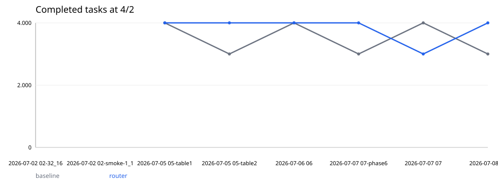

### figures/completed-8_4.svg

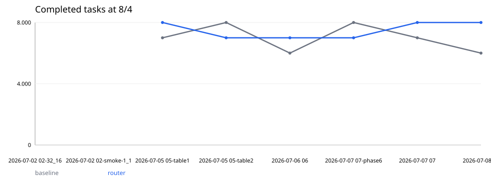

### figures/completed-16_8.svg

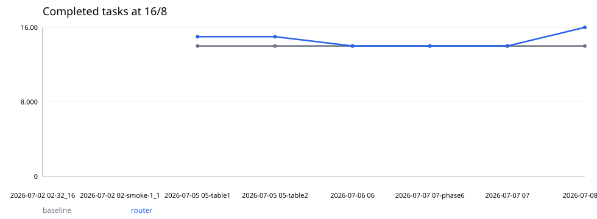

### figures/completed-32_16.svg

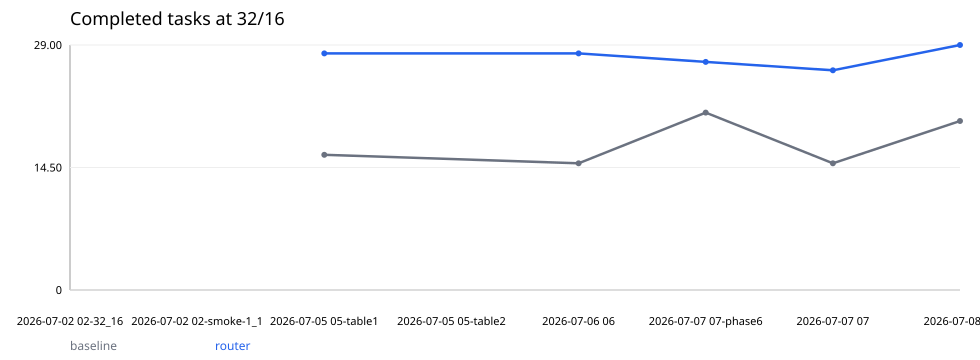

### figures/completed-64_32.svg

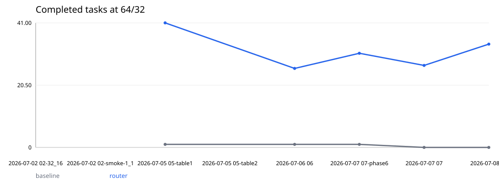

### figures/queue_mean-4_2.svg

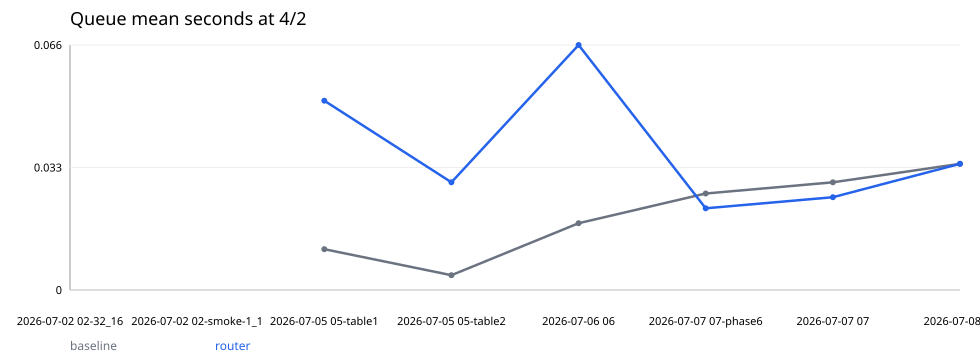

### figures/queue_mean-8_4.svg

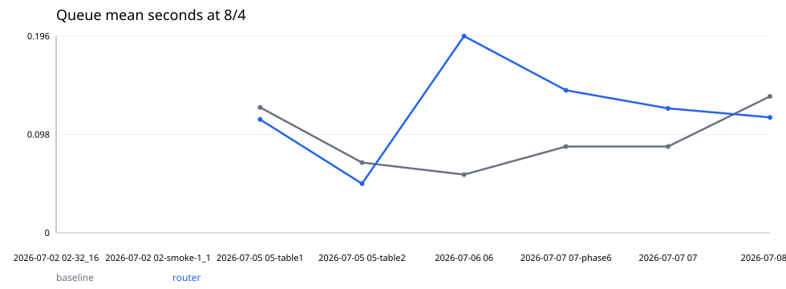

### figures/queue_mean-16_8.svg

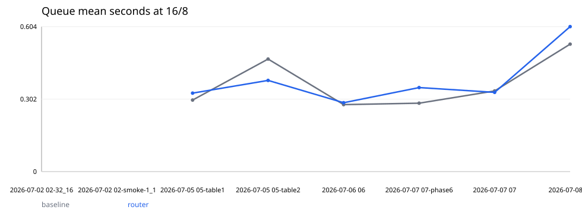

### figures/queue_mean-32_16.svg

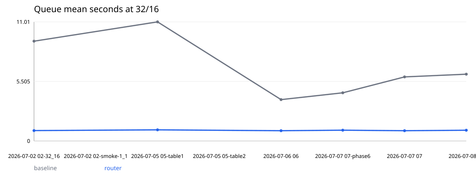

### figures/queue_mean-64_32.svg

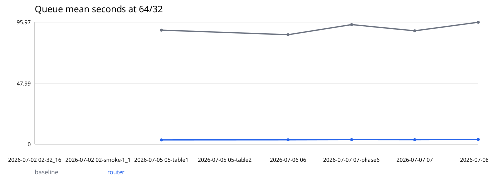

### figures/ttft_mean-4_2.svg

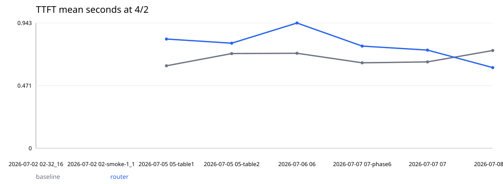

### figures/ttft_mean-8_4.svg

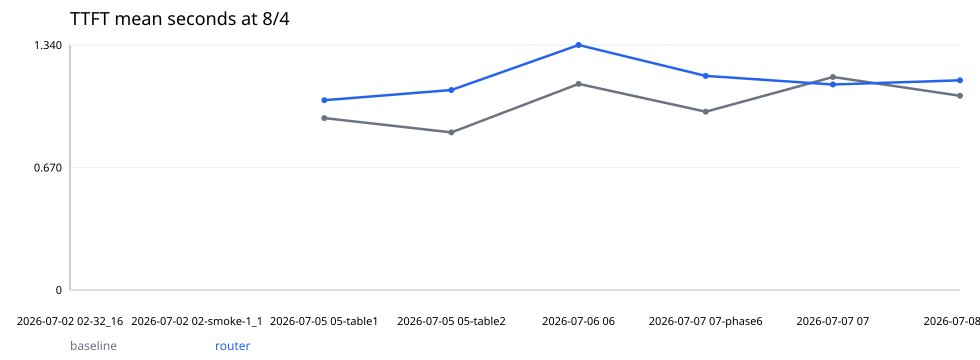

### figures/ttft_mean-16_8.svg

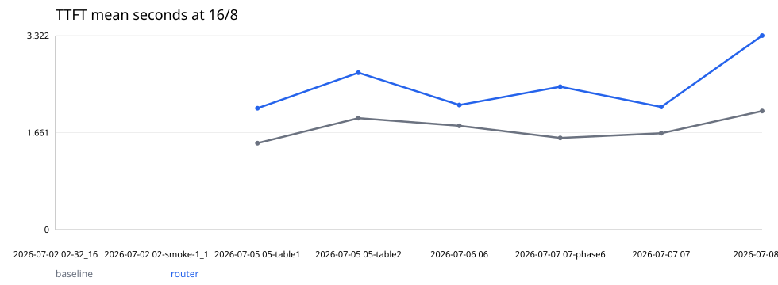

### figures/ttft_mean-32_16.svg

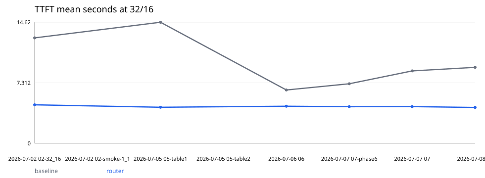

### figures/ttft_mean-64_32.svg

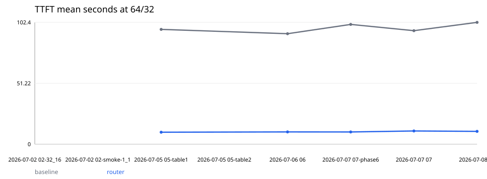

### figures/latency_mean-4_2.svg

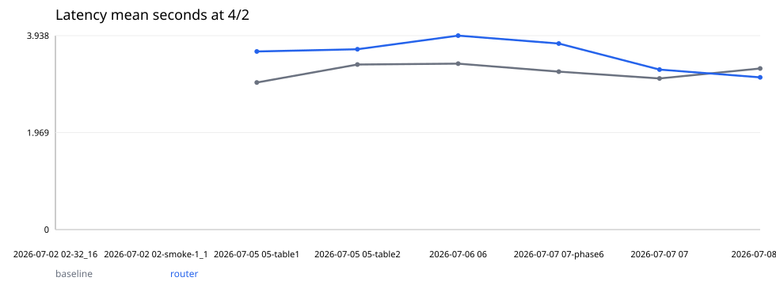

### figures/latency_mean-8_4.svg

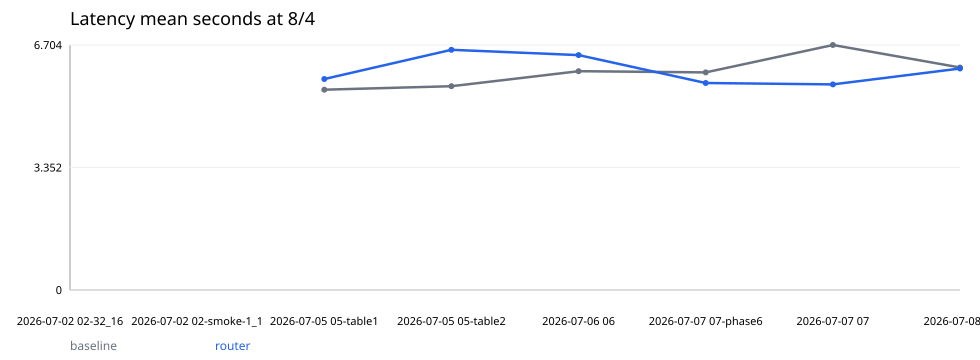

### figures/latency_mean-16_8.svg

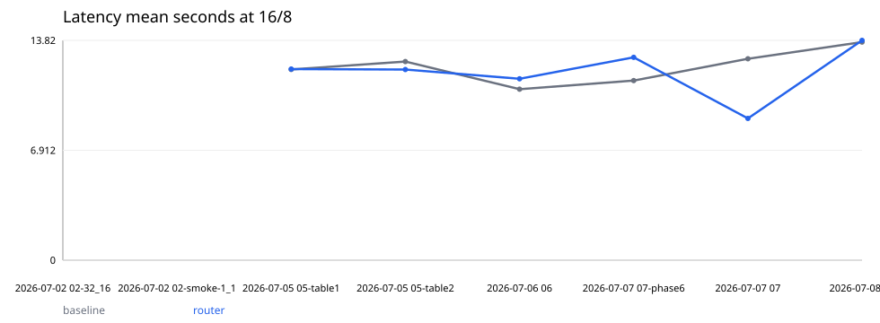

### figures/latency_mean-32_16.svg

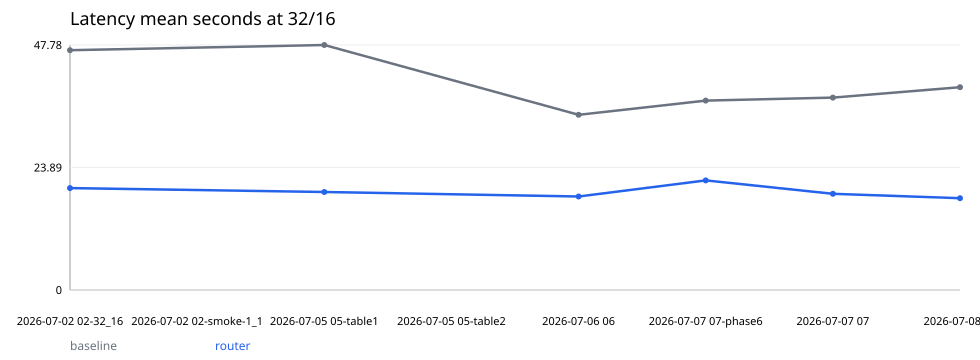

### figures/latency_mean-64_32.svg

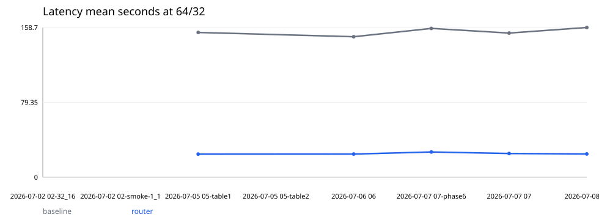

### figures/high-load-delta-completed.svg

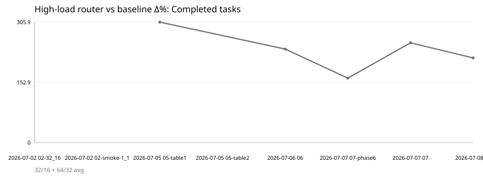

### figures/high-load-delta-queue_mean.svg

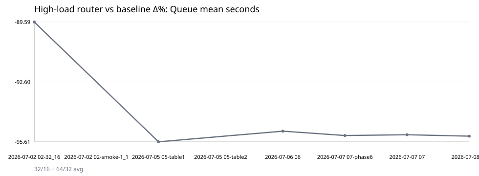

### figures/high-load-delta-ttft_mean.svg

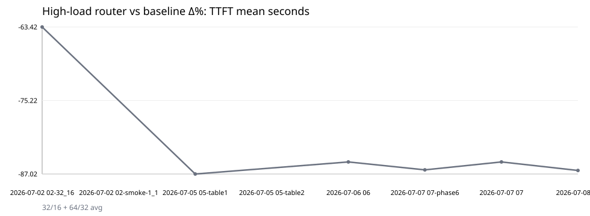

### figures/high-load-delta-latency_mean.svg

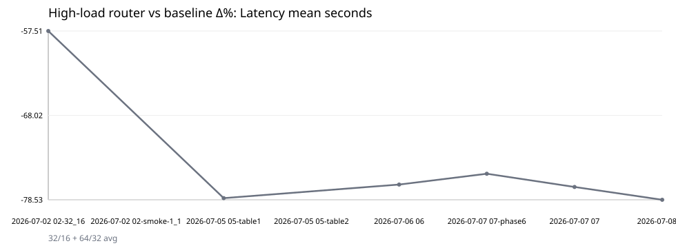

## Baseline by concurrency: completed

| run | host | status | 1/1 | 4/2 | 8/4 | 16/8 | 32/16 | 64/32 | avg |
| --- | --- | --- | --- | --- | --- | --- | --- | --- | --- |
| 2026-07-02 02-32_16 | 10015 | historical-report | — | — | — | — | — | — | — |
| 2026-07-02 02-smoke-1_1 | 10015 | historical-report | 1.000 | — | — | — | — | — | 1.000 |
| 2026-07-05 05-table1 | 10015 | historical-report | — | 4.000 | 7.000 | 14.00 | 16.00 | 1.000 | 8.400 |
| 2026-07-05 05-table2 | 10015 | historical-report | — | 3.000 | 8.000 | 14.00 | — | — | 8.333 |
| 2026-07-06 06 | 10015 | historical-report | — | 4.000 | 6.000 | 14.00 | 15.00 | 1.000 | 8.000 |
| 2026-07-07 07-phase6 | 10015 | historical-report | — | 3.000 | 8.000 | 14.00 | 21.00 | 1.000 | 9.400 |
| 2026-07-07 07 | 10015 | historical-report | — | 4.000 | 7.000 | 14.00 | 15.00 | 0.000 | 8.000 |
| 2026-07-08 08 | 10015 | historical-report | — | 3.000 | 6.000 | 14.00 | 20.00 | 0.000 | 8.600 |

## Router by concurrency: completed

| run | host | status | 1/1 | 4/2 | 8/4 | 16/8 | 32/16 | 64/32 | avg |
| --- | --- | --- | --- | --- | --- | --- | --- | --- | --- |
| 2026-07-02 02-32_16 | 10015 | historical-report | — | — | — | — | — | — | — |
| 2026-07-02 02-smoke-1_1 | 10015 | historical-report | 1.000 | — | — | — | — | — | 1.000 |
| 2026-07-05 05-table1 | 10015 | historical-report | — | 4.000 | 8.000 | 15.00 | 28.00 | 41.00 | 19.20 |
| 2026-07-05 05-table2 | 10015 | historical-report | — | 4.000 | 7.000 | 15.00 | — | — | 8.667 |
| 2026-07-06 06 | 10015 | historical-report | — | 4.000 | 7.000 | 14.00 | 28.00 | 26.00 | 15.80 |
| 2026-07-07 07-phase6 | 10015 | historical-report | — | 4.000 | 7.000 | 14.00 | 27.00 | 31.00 | 16.60 |
| 2026-07-07 07 | 10015 | historical-report | — | 3.000 | 8.000 | 14.00 | 26.00 | 27.00 | 15.60 |
| 2026-07-08 08 | 10015 | historical-report | — | 4.000 | 8.000 | 16.00 | 29.00 | 34.00 | 18.20 |

## Baseline by concurrency: failed

| run | host | status | 1/1 | 4/2 | 8/4 | 16/8 | 32/16 | 64/32 | avg |
| --- | --- | --- | --- | --- | --- | --- | --- | --- | --- |
| 2026-07-02 02-32_16 | 10015 | historical-report | — | — | — | — | — | — | — |
| 2026-07-02 02-smoke-1_1 | 10015 | historical-report | 0.000 | — | — | — | — | — | 0.000 |
| 2026-07-05 05-table1 | 10015 | historical-report | — | 0.000 | 1.000 | 2.000 | 16.00 | 63.00 | 16.40 |
| 2026-07-05 05-table2 | 10015 | historical-report | — | 1.000 | 0.000 | 2.000 | — | — | 1.000 |
| 2026-07-06 06 | 10015 | historical-report | — | 0.000 | 2.000 | 2.000 | 17.00 | 63.00 | 16.80 |
| 2026-07-07 07-phase6 | 10015 | historical-report | — | 1.000 | 0.000 | 2.000 | 11.00 | 63.00 | 15.40 |
| 2026-07-07 07 | 10015 | historical-report | — | 0.000 | 1.000 | 2.000 | 17.00 | 64.00 | 16.80 |
| 2026-07-08 08 | 10015 | historical-report | — | 1.000 | 2.000 | 2.000 | 12.00 | 64.00 | 16.20 |

## Router by concurrency: failed

| run | host | status | 1/1 | 4/2 | 8/4 | 16/8 | 32/16 | 64/32 | avg |
| --- | --- | --- | --- | --- | --- | --- | --- | --- | --- |
| 2026-07-02 02-32_16 | 10015 | historical-report | — | — | — | — | — | — | — |
| 2026-07-02 02-smoke-1_1 | 10015 | historical-report | 0.000 | — | — | — | — | — | 0.000 |
| 2026-07-05 05-table1 | 10015 | historical-report | — | 0.000 | 0.000 | 1.000 | 4.000 | 23.00 | 5.600 |
| 2026-07-05 05-table2 | 10015 | historical-report | — | 0.000 | 1.000 | 1.000 | — | — | 0.667 |
| 2026-07-06 06 | 10015 | historical-report | — | 0.000 | 1.000 | 2.000 | 4.000 | 38.00 | 9.000 |
| 2026-07-07 07-phase6 | 10015 | historical-report | — | 0.000 | 1.000 | 2.000 | 5.000 | 33.00 | 8.200 |
| 2026-07-07 07 | 10015 | historical-report | — | 1.000 | 0.000 | 2.000 | 6.000 | 37.00 | 9.200 |
| 2026-07-08 08 | 10015 | historical-report | — | 0.000 | 0.000 | 0.000 | 3.000 | 30.00 | 6.600 |

## Baseline by concurrency: patches

| run | host | status | 1/1 | 4/2 | 8/4 | 16/8 | 32/16 | 64/32 | avg |
| --- | --- | --- | --- | --- | --- | --- | --- | --- | --- |
| 2026-07-02 02-32_16 | 10015 | historical-report | — | — | — | — | — | — | — |
| 2026-07-02 02-smoke-1_1 | 10015 | historical-report | — | — | — | — | — | — | — |
| 2026-07-05 05-table1 | 10015 | historical-report | — | — | — | — | — | — | — |
| 2026-07-05 05-table2 | 10015 | historical-report | — | — | — | — | — | — | — |
| 2026-07-06 06 | 10015 | historical-report | — | — | — | — | — | — | — |
| 2026-07-07 07-phase6 | 10015 | historical-report | — | 3.000 | 8.000 | 13.00 | 16.00 | 0.000 | 8.000 |
| 2026-07-07 07 | 10015 | historical-report | — | 4.000 | 6.000 | 14.00 | 13.00 | 0.000 | 7.400 |
| 2026-07-08 08 | 10015 | historical-report | — | 3.000 | 6.000 | 13.00 | 14.00 | 0.000 | 7.200 |

## Router by concurrency: patches

| run | host | status | 1/1 | 4/2 | 8/4 | 16/8 | 32/16 | 64/32 | avg |
| --- | --- | --- | --- | --- | --- | --- | --- | --- | --- |
| 2026-07-02 02-32_16 | 10015 | historical-report | — | — | — | — | — | — | — |
| 2026-07-02 02-smoke-1_1 | 10015 | historical-report | — | — | — | — | — | — | — |
| 2026-07-05 05-table1 | 10015 | historical-report | — | — | — | — | — | — | — |
| 2026-07-05 05-table2 | 10015 | historical-report | — | — | — | — | — | — | — |
| 2026-07-06 06 | 10015 | historical-report | — | — | — | — | — | — | — |
| 2026-07-07 07-phase6 | 10015 | historical-report | — | 3.000 | 7.000 | 13.00 | 27.00 | 31.00 | 16.20 |
| 2026-07-07 07 | 10015 | historical-report | — | 3.000 | 7.000 | 12.00 | 26.00 | 26.00 | 14.80 |
| 2026-07-08 08 | 10015 | historical-report | — | 4.000 | 8.000 | 15.00 | 29.00 | 32.00 | 17.60 |

## Baseline by concurrency: wall_s

| run | host | status | 1/1 | 4/2 | 8/4 | 16/8 | 32/16 | 64/32 | avg |
| --- | --- | --- | --- | --- | --- | --- | --- | --- | --- |
| 2026-07-02 02-32_16 | 10015 | historical-report | — | — | — | — | — | — | — |
| 2026-07-02 02-smoke-1_1 | 10015 | historical-report | 224.1 | — | — | — | — | — | 224.1 |
| 2026-07-05 05-table1 | 10015 | historical-report | — | 570.1 | 1090.9 | 2010.6 | 5714.1 | 7356.2 | 3348.4 |
| 2026-07-05 05-table2 | 10015 | historical-report | — | 731.7 | 1059.6 | 2323.3 | — | — | 1371.5 |
| 2026-07-06 06 | 10015 | historical-report | — | 726.0 | 4106.8 | 4543.6 | 7313.9 | 7355.7 | 4809.2 |
| 2026-07-07 07-phase6 | 10015 | historical-report | — | 599.6 | 1147.2 | 3615.9 | 6127.4 | 7348.3 | 3767.7 |
| 2026-07-07 07 | 10015 | historical-report | — | 748.7 | 3616.1 | 2113.2 | 7272.5 | 7345.5 | 4219.2 |
| 2026-07-08 08 | 10015 | historical-report | — | 650.2 | 1140.5 | 3615.7 | 5887.5 | 7346.2 | 3728.0 |

## Router by concurrency: wall_s

| run | host | status | 1/1 | 4/2 | 8/4 | 16/8 | 32/16 | 64/32 | avg |
| --- | --- | --- | --- | --- | --- | --- | --- | --- | --- |
| 2026-07-02 02-32_16 | 10015 | historical-report | — | — | — | — | — | — | — |
| 2026-07-02 02-smoke-1_1 | 10015 | historical-report | 206.4 | — | — | — | — | — | 206.4 |
| 2026-07-05 05-table1 | 10015 | historical-report | — | 675.4 | 997.0 | 2098.7 | 4217.7 | 7283.0 | 3054.4 |
| 2026-07-05 05-table2 | 10015 | historical-report | — | 753.9 | 3621.4 | 2316.2 | — | — | 2230.5 |
| 2026-07-06 06 | 10015 | historical-report | — | 785.0 | 1051.4 | 4687.9 | 4391.5 | 7321.3 | 3647.4 |
| 2026-07-07 07-phase6 | 10015 | historical-report | — | 690.4 | 996.8 | 2313.3 | 4113.7 | 7288.3 | 3080.5 |
| 2026-07-07 07 | 10015 | historical-report | — | 670.7 | 1187.8 | 4801.0 | 4656.3 | 7306.5 | 3724.5 |
| 2026-07-08 08 | 10015 | historical-report | — | 587.3 | 1142.2 | 2574.0 | 6870.8 | 7279.8 | 3690.8 |

## Baseline by concurrency: latency_mean

| run | host | status | 1/1 | 4/2 | 8/4 | 16/8 | 32/16 | 64/32 | avg |
| --- | --- | --- | --- | --- | --- | --- | --- | --- | --- |
| 2026-07-02 02-32_16 | 10015 | historical-report | — | — | — | — | 46.76 | — | 46.76 |
| 2026-07-02 02-smoke-1_1 | 10015 | historical-report | — | — | — | — | — | — | — |
| 2026-07-05 05-table1 | 10015 | historical-report | — | 2.986 | 5.481 | 11.99 | 47.78 | 153.4 | 44.33 |
| 2026-07-05 05-table2 | 10015 | historical-report | — | 3.351 | 5.578 | 12.49 | — | — | 7.140 |
| 2026-07-06 06 | 10015 | historical-report | — | 3.369 | 5.987 | 10.75 | 34.17 | 148.9 | 40.64 |
| 2026-07-07 07-phase6 | 10015 | historical-report | — | 3.207 | 5.953 | 11.29 | 36.93 | 157.8 | 43.03 |
| 2026-07-07 07 | 10015 | historical-report | — | 3.068 | 6.704 | 12.67 | 37.53 | 152.8 | 42.56 |
| 2026-07-08 08 | 10015 | historical-report | — | 3.271 | 6.089 | 13.71 | 39.54 | 158.7 | 44.26 |

## Router by concurrency: latency_mean

| run | host | status | 1/1 | 4/2 | 8/4 | 16/8 | 32/16 | 64/32 | avg |
| --- | --- | --- | --- | --- | --- | --- | --- | --- | --- |
| 2026-07-02 02-32_16 | 10015 | historical-report | — | — | — | — | 19.87 | — | 19.87 |
| 2026-07-02 02-smoke-1_1 | 10015 | historical-report | — | — | — | — | — | — | — |
| 2026-07-05 05-table1 | 10015 | historical-report | — | 3.617 | 5.773 | 12.02 | 19.12 | 24.50 | 13.01 |
| 2026-07-05 05-table2 | 10015 | historical-report | — | 3.662 | 6.574 | 11.99 | — | — | 7.409 |
| 2026-07-06 06 | 10015 | historical-report | — | 3.938 | 6.427 | 11.41 | 18.23 | 24.55 | 12.91 |
| 2026-07-07 07-phase6 | 10015 | historical-report | — | 3.778 | 5.665 | 12.76 | 21.36 | 26.76 | 14.06 |
| 2026-07-07 07 | 10015 | historical-report | — | 3.248 | 5.625 | 8.915 | 18.75 | 25.16 | 12.34 |
| 2026-07-08 08 | 10015 | historical-report | — | 3.091 | 6.060 | 13.82 | 17.91 | 24.66 | 13.11 |

## Baseline by concurrency: ttft_mean

| run | host | status | 1/1 | 4/2 | 8/4 | 16/8 | 32/16 | 64/32 | avg |
| --- | --- | --- | --- | --- | --- | --- | --- | --- | --- |
| 2026-07-02 02-32_16 | 10015 | historical-report | — | — | — | — | 12.74 | — | 12.74 |
| 2026-07-02 02-smoke-1_1 | 10015 | historical-report | — | — | — | — | — | — | — |
| 2026-07-05 05-table1 | 10015 | historical-report | — | 0.621 | 0.940 | 1.480 | 14.62 | 96.54 | 22.84 |
| 2026-07-05 05-table2 | 10015 | historical-report | — | 0.713 | 0.862 | 1.909 | — | — | 1.161 |
| 2026-07-06 06 | 10015 | historical-report | — | 0.715 | 1.127 | 1.777 | 6.447 | 92.90 | 20.59 |
| 2026-07-07 07-phase6 | 10015 | historical-report | — | 0.643 | 0.975 | 1.570 | 7.201 | 100.7 | 22.23 |
| 2026-07-07 07 | 10015 | historical-report | — | 0.650 | 1.165 | 1.650 | 8.754 | 95.46 | 21.54 |
| 2026-07-08 08 | 10015 | historical-report | — | 0.736 | 1.062 | 2.031 | 9.178 | 102.4 | 23.09 |

## Router by concurrency: ttft_mean

| run | host | status | 1/1 | 4/2 | 8/4 | 16/8 | 32/16 | 64/32 | avg |
| --- | --- | --- | --- | --- | --- | --- | --- | --- | --- |
| 2026-07-02 02-32_16 | 10015 | historical-report | — | — | — | — | 4.659 | — | 4.659 |
| 2026-07-02 02-smoke-1_1 | 10015 | historical-report | — | — | — | — | — | — | — |
| 2026-07-05 05-table1 | 10015 | historical-report | — | 0.822 | 1.038 | 2.078 | 4.366 | 10.07 | 3.674 |
| 2026-07-05 05-table2 | 10015 | historical-report | — | 0.791 | 1.094 | 2.688 | — | — | 1.524 |
| 2026-07-06 06 | 10015 | historical-report | — | 0.943 | 1.340 | 2.134 | 4.490 | 10.33 | 3.847 |
| 2026-07-07 07-phase6 | 10015 | historical-report | — | 0.769 | 1.171 | 2.447 | 4.429 | 10.30 | 3.823 |
| 2026-07-07 07 | 10015 | historical-report | — | 0.739 | 1.124 | 2.100 | 4.443 | 11.11 | 3.902 |
| 2026-07-08 08 | 10015 | historical-report | — | 0.607 | 1.147 | 3.322 | 4.340 | 10.79 | 4.040 |

## Baseline by concurrency: queue_mean

| run | host | status | 1/1 | 4/2 | 8/4 | 16/8 | 32/16 | 64/32 | avg |
| --- | --- | --- | --- | --- | --- | --- | --- | --- | --- |
| 2026-07-02 02-32_16 | 10015 | historical-report | — | — | — | — | 9.228 | — | 9.228 |
| 2026-07-02 02-smoke-1_1 | 10015 | historical-report | — | — | — | — | — | — | — |
| 2026-07-05 05-table1 | 10015 | historical-report | — | 0.011 | 0.125 | 0.298 | 11.01 | 89.77 | 20.24 |
| 2026-07-05 05-table2 | 10015 | historical-report | — | 0.004 | 0.070 | 0.469 | — | — | 0.181 |
| 2026-07-06 06 | 10015 | historical-report | — | 0.018 | 0.058 | 0.279 | 3.826 | 86.23 | 18.08 |
| 2026-07-07 07-phase6 | 10015 | historical-report | — | 0.026 | 0.086 | 0.285 | 4.452 | 94.12 | 19.79 |
| 2026-07-07 07 | 10015 | historical-report | — | 0.029 | 0.086 | 0.336 | 5.921 | 89.26 | 19.13 |
| 2026-07-08 08 | 10015 | historical-report | — | 0.034 | 0.136 | 0.531 | 6.173 | 95.97 | 20.57 |

## Router by concurrency: queue_mean

| run | host | status | 1/1 | 4/2 | 8/4 | 16/8 | 32/16 | 64/32 | avg |
| --- | --- | --- | --- | --- | --- | --- | --- | --- | --- |
| 2026-07-02 02-32_16 | 10015 | historical-report | — | — | — | — | 0.961 | — | 0.961 |
| 2026-07-02 02-smoke-1_1 | 10015 | historical-report | — | — | — | — | — | — | — |
| 2026-07-05 05-table1 | 10015 | historical-report | — | 0.051 | 0.113 | 0.327 | 1.030 | 3.394 | 0.983 |
| 2026-07-05 05-table2 | 10015 | historical-report | — | 0.029 | 0.049 | 0.380 | — | — | 0.153 |
| 2026-07-06 06 | 10015 | historical-report | — | 0.066 | 0.196 | 0.287 | 0.949 | 3.485 | 0.997 |
| 2026-07-07 07-phase6 | 10015 | historical-report | — | 0.022 | 0.142 | 0.350 | 0.996 | 3.641 | 1.030 |
| 2026-07-07 07 | 10015 | historical-report | — | 0.025 | 0.124 | 0.330 | 0.949 | 3.565 | 0.999 |
| 2026-07-08 08 | 10015 | historical-report | — | 0.034 | 0.115 | 0.604 | 0.994 | 3.779 | 1.105 |

## Baseline by concurrency: prefix_hit

| run | host | status | 1/1 | 4/2 | 8/4 | 16/8 | 32/16 | 64/32 | avg |
| --- | --- | --- | --- | --- | --- | --- | --- | --- | --- |
| 2026-07-02 02-32_16 | 10015 | historical-report | — | — | — | — | — | — | — |
| 2026-07-02 02-smoke-1_1 | 10015 | historical-report | 0.934 | — | — | — | — | — | 0.934 |
| 2026-07-05 05-table1 | 10015 | historical-report | — | 0.941 | 0.937 | 0.922 | 0.694 | 0.115 | 0.722 |
| 2026-07-05 05-table2 | 10015 | historical-report | — | 0.941 | 0.942 | 0.908 | — | — | 0.930 |
| 2026-07-06 06 | 10015 | historical-report | — | 0.928 | 0.985 | 0.966 | 0.826 | 0.106 | 0.762 |
| 2026-07-07 07-phase6 | 10015 | historical-report | — | 0.930 | 0.936 | 0.953 | 0.788 | 0.088 | 0.739 |
| 2026-07-07 07 | 10015 | historical-report | — | 0.942 | 0.981 | 0.918 | 0.833 | 0.084 | 0.752 |
| 2026-07-08 08 | 10015 | historical-report | — | 0.935 | 0.932 | 0.911 | 0.754 | 0.091 | 0.725 |

## Router by concurrency: prefix_hit

| run | host | status | 1/1 | 4/2 | 8/4 | 16/8 | 32/16 | 64/32 | avg |
| --- | --- | --- | --- | --- | --- | --- | --- | --- | --- |
| 2026-07-02 02-32_16 | 10015 | historical-report | — | — | — | — | — | — | — |
| 2026-07-02 02-smoke-1_1 | 10015 | historical-report | 0.951 | — | — | — | — | — | 0.951 |
| 2026-07-05 05-table1 | 10015 | historical-report | — | 0.935 | 0.934 | 0.918 | 0.896 | 0.859 | 0.908 |
| 2026-07-05 05-table2 | 10015 | historical-report | — | 0.942 | 0.980 | 0.912 | — | — | 0.945 |
| 2026-07-06 06 | 10015 | historical-report | — | 0.938 | 0.930 | 0.961 | 0.890 | 0.850 | 0.914 |
| 2026-07-07 07-phase6 | 10015 | historical-report | — | 0.933 | 0.938 | 0.910 | 0.886 | 0.848 | 0.903 |
| 2026-07-07 07 | 10015 | historical-report | — | 0.934 | 0.936 | 0.971 | 0.905 | 0.843 | 0.918 |
| 2026-07-08 08 | 10015 | historical-report | — | 0.944 | 0.938 | 0.907 | 0.935 | 0.851 | 0.915 |

## Baseline vs router average comparison

| run | completed Δ% | failed Δ% | patches Δ% | wall_s Δ% | latency_mean Δ% | ttft_mean Δ% | queue_mean Δ% | prefix_hit Δ% |
| --- | --- | --- | --- | --- | --- | --- | --- | --- |
| 2026-07-02 02-32_16 | — | — | — | — | -57.5% | -63.4% | -89.6% | — |
| 2026-07-02 02-smoke-1_1 | +0.0% | — | — | -7.9% | — | — | — | +1.8% |
| 2026-07-05 05-table1 | +128.6% | -65.9% | — | -8.8% | -70.7% | -83.9% | -95.1% | +25.9% |
| 2026-07-05 05-table2 | +4.0% | -33.3% | — | +62.6% | +3.8% | +31.3% | -15.7% | +1.5% |
| 2026-07-06 06 | +97.5% | -46.4% | — | -24.2% | -68.2% | -81.3% | -94.5% | +19.9% |
| 2026-07-07 07-phase6 | +76.6% | -46.8% | +102.5% | -18.2% | -67.3% | -82.8% | -94.8% | +22.2% |
| 2026-07-07 07 | +95.0% | -45.2% | +100.0% | -11.7% | -71.0% | -81.9% | -94.8% | +22.1% |
| 2026-07-08 08 | +111.6% | -59.3% | +144.4% | -1.0% | -70.4% | -82.5% | -94.6% | +26.3% |

## High-load comparison only: 32/16 + 64/32

| run | completed Δ% | failed Δ% | patches Δ% | wall_s Δ% | latency_mean Δ% | ttft_mean Δ% | queue_mean Δ% | prefix_hit Δ% |
| --- | --- | --- | --- | --- | --- | --- | --- | --- |
| 2026-07-02 02-32_16 | — | — | — | — | -57.5% | -63.4% | -89.6% | — |
| 2026-07-02 02-smoke-1_1 | — | — | — | — | — | — | — | — |
| 2026-07-05 05-table1 | +305.9% | -65.8% | — | -12.0% | -78.3% | -87.0% | -95.6% | +116.9% |
| 2026-07-05 05-table2 | — | — | — | — | — | — | — | — |
| 2026-07-06 06 | +237.5% | -47.5% | — | -20.2% | -76.6% | -85.1% | -95.1% | +86.7% |
| 2026-07-07 07-phase6 | +163.6% | -48.6% | +262.5% | -15.4% | -75.3% | -86.4% | -95.3% | +97.9% |
| 2026-07-07 07 | +253.3% | -46.9% | +300.0% | -18.2% | -76.9% | -85.1% | -95.3% | +90.6% |
| 2026-07-08 08 | +215.0% | -56.6% | +335.7% | +6.9% | -78.5% | -86.4% | -95.3% | +111.4% |

